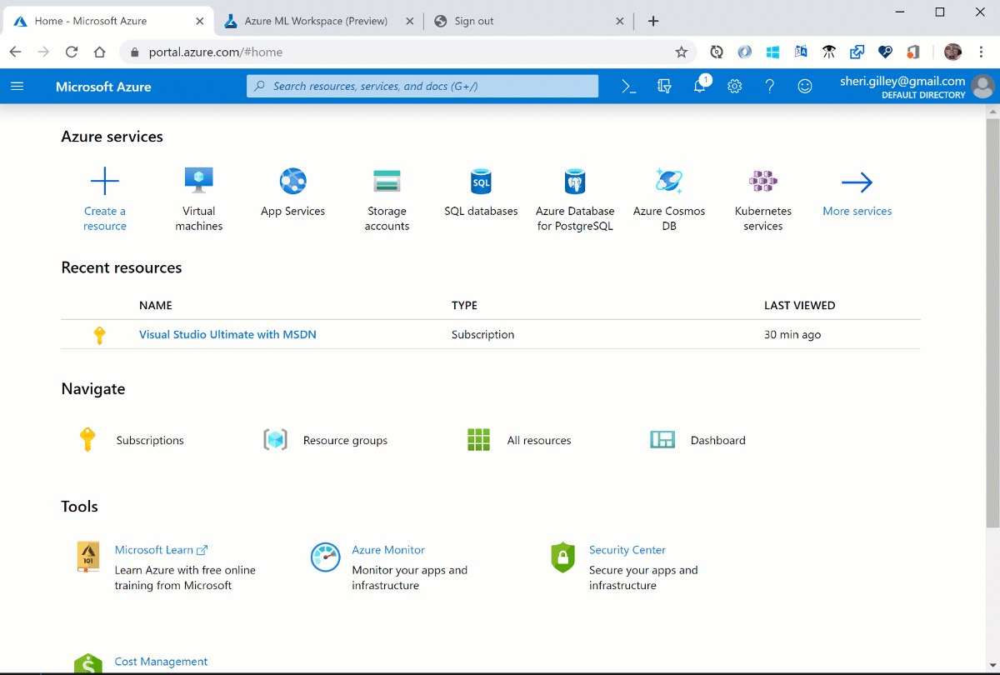

1. Sign in to the [Azure portal](https://portal.azure.com/) by using the credentials for your Azure subscription. 

1. In the upper-left corner of the Azure portal, select **+ Create a resource**.

      

1. Use the search bar to find **Machine Learning**.

1. Select **Machine Learning**.

1. In the **Machine Learning** pane, select **Create** to begin.

1. Provide the following information to configure your new workspace:

   Field|Description 
   ---|---
   Workspace name |Enter a unique name that identifies your workspace. In this example, we use **docs-ws**. Names must be unique across the resource group. Use a name that's easy to recall and to differentiate from workspaces created by others. 
   Subscription |Select the Azure subscription that you want to use.
   Resource group | Use an existing resource group in your subscription, or enter a name to create a new resource group. A resource group holds related resources for an Azure solution. In this example, we use **docs-aml**. 
   Location | Select the location closest to your users and the data resources to create your workspace.
   Workspace edition | Select **Enterprise**. This tutorial requires the use of the Enterprise edition. The Enterprise edition is in preview and doesn't currently add any extra costs. 

1. After you're finished configuring the workspace, select **Create**. 

   > [!WARNING] 
   > It can take several minutes to create your workspace in the cloud.

   When the process is finished, a deployment success message appears. 
 
 1. To view the new workspace, select **Go to resource**.

