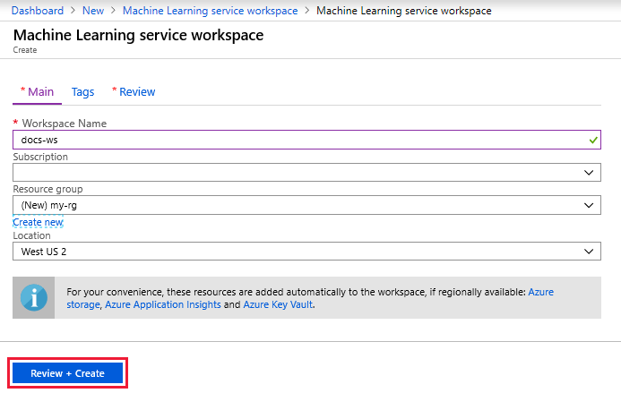
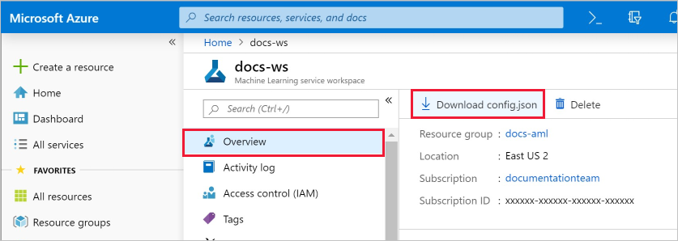

1. Sign in to the [Azure portal](https://portal.azure.com/) by using the credentials for the Azure subscription you use. 

1. In the upper-left corner of Azure portal, select **Create a resource**.

1. Use the search bar to find **Machine Learning service workspace**.

1. Select **Machine Learning service workspace**.

1. In the **ML service workspace** pane, select **Create** to begin.

1. Configure your new workspace by providing the workspace name, subscription, resource group, and location.

    

   Field|Description 
   ---|---
   Workspace name |Enter a unique name that identifies your workspace. In this example, we use **docs-ws**. Names must be unique across the resource group. Use a name that's easy to recall and to differentiate from workspaces created by others.  
   Subscription |Select the Azure subscription that you want to use.
   Resource group | Use an existing resource group in your subscription or enter a name to create a new resource group. A resource group holds related resources for an Azure solution. In this example, we use **docs-aml**. 
   Location | Select the location closest to your users and the data resources to create your workspace.

1. After you are finished configuring the workspace, select **Create**. 

   It can take a few moments to create the workspace.

   When the process is finished, a deployment success message appears. It's also present in the notifications section. To view the new workspace, select **Go to resource**.

   

1. If you will be using a code-free option from the portal, such as the visual interface or automated ML experiments, you are done now. If you will be creating a [Notebook VM](../articles/machine-learning/service/tutorial-1st-experiment-sdk-setup.md#azure) you are also done. 

1. If you plan to use code on your local environment that references this workspace, select  **Download config.json** from the **Overview** section of the workspace.  

   
   
   Place the file into  the directory structure with your Python scripts or Jupyter Notebooks. It can be in the same directory, a subdirectory named *.azureml*, or in a parent directory. When you create a Notebook VM, this file is added to correct directory on the VM for you.

    

