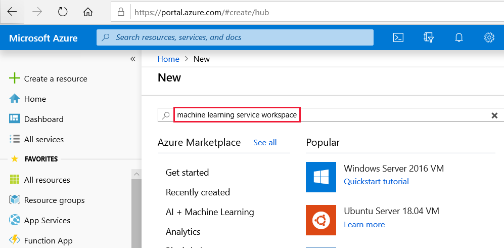

1. Sign in to the [Azure portal](https://portal.azure.com/) by using the credentials for the Azure subscription you use. 

   

1. In the upper-left corner of the portal, select **Create a resource**.

   

1. In the search bar, enter **Machine Learning**. Select the **Machine Learning service workspace** search result.

   

1. In the **ML service workspace** pane, scroll to the bottom and select **Create** to begin.

   

1. In the **ML service workspace** pane, configure your workspace.

   Field|Description
   ---|---
   Workspace name |Enter a unique name that identifies your workspace. In this example, we use **docs-ws**. Names must be unique across the resource group. Use a name that's easy to recall and differentiate from workspaces created by others.  
   Subscription |Select the Azure subscription that you want to use.
   Resource group | Use an existing resource group in your subscription, or enter a name to create a new resource group. A resource group holds related resources for an Azure solution. In this example, we use **docs-aml**. 
   Location | Select the location closest to your users and the data resources. This location is where the workspace is created.

   

1. To start the creation process, select **Create**. It can take a few moments to create the workspace.

1. To check on the status of the deployment, select the Notifications icon, **bell**, on the toolbar.

1. When the process is finished, a deployment success message appears. It's also present in the notifications section. To view the new workspace, select **Go to resource**.

   
