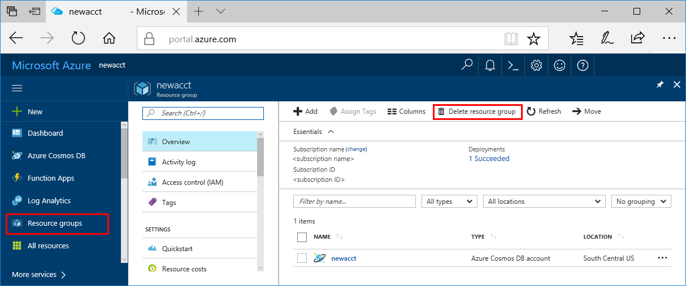

>[!IMPORTANT]
>The resources you created can be used as prerequisites to other Azure Machine Learning service tutorials and how-to articles. 

If you don't plan to use the resources you created, delete them, so you don't incur any charges:

1. In the Azure portal, select **Resource groups** on the far left.
 
   

1. From the list, select the resource group you created.

1. Select **Delete resource group**.

1. Enter the resource group name. Then select **Delete**.
