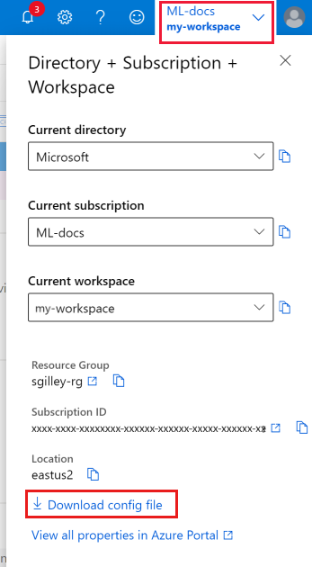

1. [Create an Azure Machine Learning workspace](../articles/machine-learning/how-to-manage-workspace.md).

1. Clone [the GitHub repository](https://aka.ms/aml-notebooks).

    ```bash
    git clone https://github.com/Azure/MachineLearningNotebooks.git
    ```

1. Add a workspace configuration file to the cloned directory using either of these methods:

    * In the [Azure portal](https://ms.portal.azure.com), select  **Download config.json** from the **Overview** section of your workspace. 

    

    * Create a new workspace using code in the [configuration.ipynb](https://github.com/Azure/MachineLearningNotebooks/blob/master/configuration.ipynb) notebook in your cloned directory.

1. Start the notebook server from your cloned directory.

    ```bash
    jupyter notebook
    ```