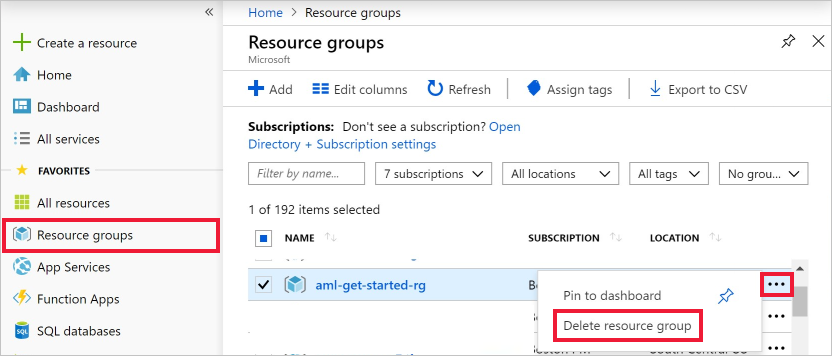
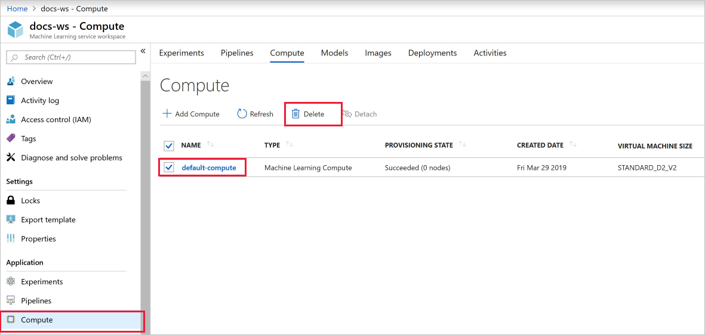
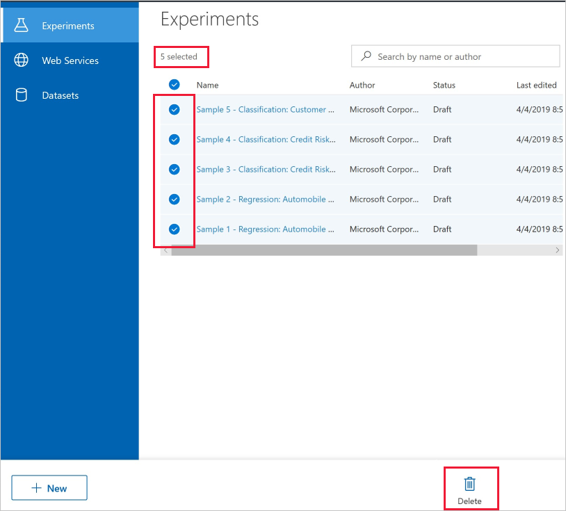

>[!IMPORTANT]
>You can use the resources that you created as prerequisites for other Azure Machine Learning service tutorials and how-to articles.

### Delete everything

If you don't plan to use anything that you created, delete the entire resource group so you don't incur any charges:

1. In the Azure portal, select **Resource groups** on the left side of the window.
 
   

1. In the list, select the resource group that you created.

1. On the right side of the window, select the ellipsis button (**...**).

1. Select **Delete resource group**.

Deleting the resource group also deletes all resources that you created in the visual interface.  

### Delete only the compute target

The compute target that you created here *automatically autoscales* to zero nodes when it's not being used. This is to minimize charges. If you want to delete the compute target, take these steps:

1. In the [Azure portal](https://portal.azure.com), open your workspace.

    

1. In the **Compute** section of your workspace, select the resource.

1. Select **Delete**.

### Delete individual assets

In the visual interface where you created your experiment, delete individual assets by selecting them and then selecting the **Delete** button.

