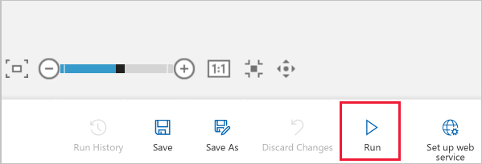
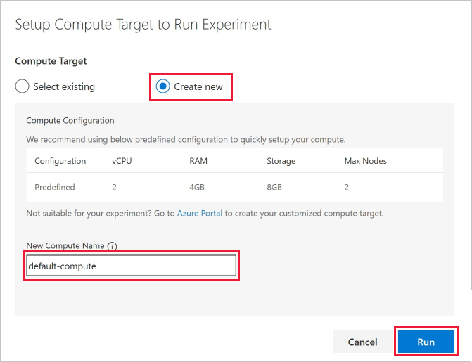

An experiment runs on a compute target, a compute resource that is attached to your workspace.  Once you create a compute target, you can reuse it for future runs.

1. Select **Run** at the bottom to run the experiment.

     

1. When the **Setup Compute Targets** dialog appears, if your workspace already has a compute resource, you can select it now.  Otherwise, select **Create new**.

    > [!NOTE]
    > The visual interface can only run experiments on Machine Learning Compute targets. Other compute targets will not be shown.

1. Provide a name for the compute resource.

1. Select **Run**.

    

    The compute resource will now be created. View the status in the top-right corner of the experiment. 

    > [!NOTE]
    > It takes approximately 5 minutes to create a compute resource. After the resource is created, you can reuse it and skip this wait time for future runs.
    >
    > The compute resource will autoscale to 0 nodes when it is idle to save cost.  When you use it again after a delay, you may again experience approximately 5 minutes of wait time while it scales back up.
