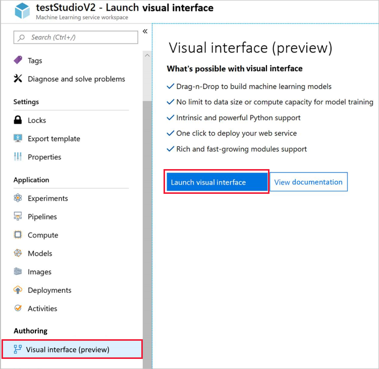

1. [Create an Azure Machine Learning workspace](../articles/machine-learning/service/setup-create-workspace.md#portal) if you don't have one.

1. Open your workspace in the [Azure portal](https://portal.azure.com/).  If you're not sure how to locate your workspace in the portal, see [how to find your workspace](../articles/machine-learning/service/how-to-manage-workspace.md#view).

1. In your workspace, select **Visual interface**.  Then select **Launch visual interface**.  
 
    

    The interface webpage opens in a new browser page.  

