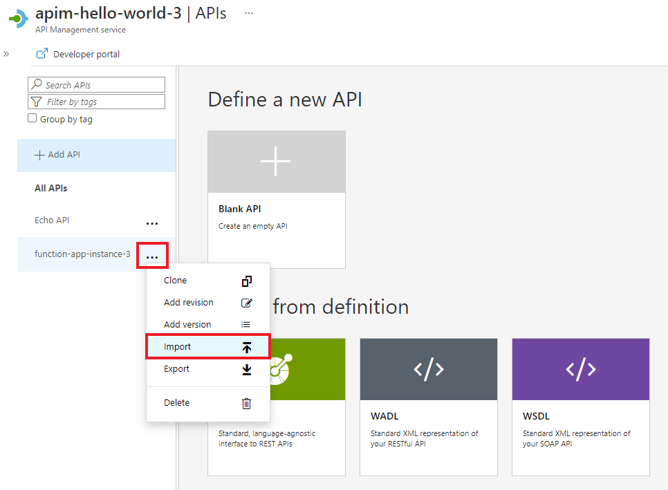
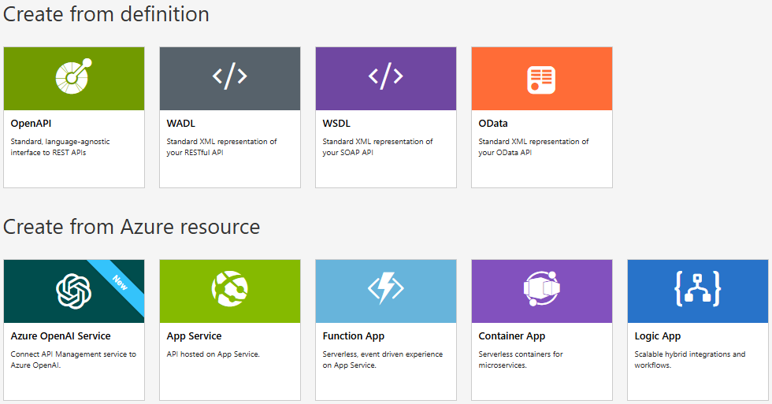

## Append other APIs

You can compose an API of APIs exposed by different services, including:
* The OpenAPI Specification
* A SOAP API
* The API Apps feature of Azure App Service
* Azure Function App
* Azure Logic Apps
* Azure Service Fabric

Append a different API to your existing API using the following steps. 

>[!NOTE] 
> When you import another API, the operations are appended to your current API.

1. Go to your Azure API Management instance in the Azure portal.

    

1. Select **APIs** from the menu on the left.

    

1. Click **...** next to the API that you want to append another API to.
1. Select **Import** from the drop-down menu.

    

1. Select a service from which to import an API.

    
