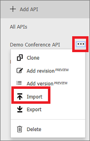

## Append other APIs

An API can be composed of APIs exposed by different services, including the OpenAPI Specification, a SOAP API, an Azure Web App, Azure Function App, Azure Logic Apps, and Azure Service Fabric.

To append a different API to your existing API, complete the following steps. When you import another API, the operations are appended to your current API.

1. Go to your Azure API Management instance in the Azure portal.
2. Select **APIs** from the menu on the left.
3. Select **...** next to the API that you want to append another API to.
4. Select **Import** from the drop-down menu.
5. Select a service from which to import an API.