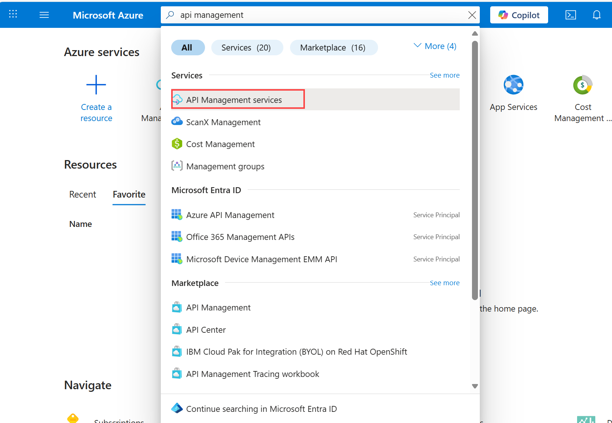
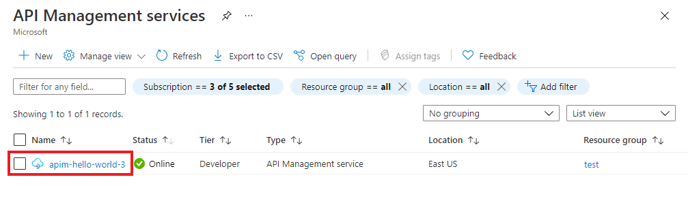

## Go to your API Management instance

1. In the Azure portal, search for and select **API Management services**.

   

1. On the **API Management services** page, select your API Management instance.

   

