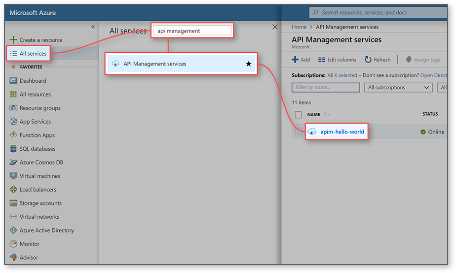

## Go to your API Management instance

1. Sign in to the [Azure portal](https://portal.azure.com). 

2. Select **All services**.  

3. In the search box, enter `api management`.

4. In the search results, select **API Management services**.

5. Select your API Management service instance.

> [!TIP]
> To add API Management to your favorites in the Azure portal, select the star.
>
> The API Management icon () now appears in the left menu in the portal.

