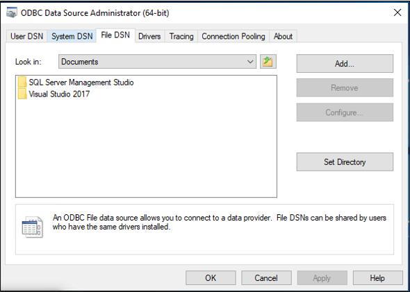
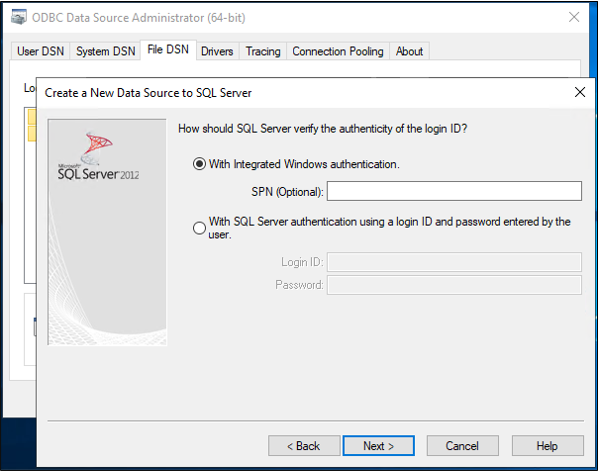
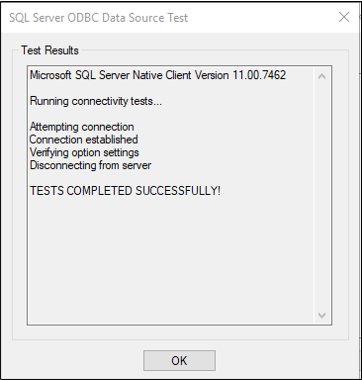

This document describes the steps you need to perform to automatically provision and deprovision users from Azure Active Directory (Azure AD) into an SQL database.  
 
For important details on what this service does, how it works, and frequently asked questions, check out the [Automate user provisioning and deprovisioning to SaaS applications with Azure Active Directory](../articles/active-directory/app-provisioning/user-provisioning.md) and [on-premises application provisioning architecture](../articles/active-directory/app-provisioning/on-premises-application-provisioning-architecture.md) articles. 


The following video provides an overview of on-premises provisioning.

> [!VIDEO https://www.youtube.com/embed/QdfdpaFolys]

## Prerequisites for provisioning to a SQL Database

### On-premises prerequisites

The application relies upon an SQL database, in which records for users can be created, updated, and deleted. The computer that runs the provisioning agent should have:

- A Windows Server 2016 or a later version. 
-  Connectivity to the target database system, and with outbound connectivity to login.microsoftonline.com, [other Microsoft Online Services](/microsoft-365/enterprise/urls-and-ip-address-ranges) and [Azure](../articles/azure-portal/azure-portal-safelist-urls.md) domains. An example is a Windows Server 2016 virtual machine hosted in Azure IaaS or behind a proxy. 
- At least 3 GB of RAM, to host a provisioning agent. 
- .NET Framework 4.7.2 
- An ODBC driver for the SQL database.

Configuration of the connection to the application's database is done via a wizard. Depending on the options you select, some of the wizard screens might not be available and the information might be slightly different. Use the following information to guide you in your configuration.

#### Supported databases

- Microsoft SQL Server and Azure SQL
- IBM DB2 10.x
- IBM DB2 9.x
- Oracle 10g and 11g
- Oracle 12c and 18c
- MySQL 5.x
- MySQL 8.x
- Postgres

### Cloud requirements

 - An Azure AD tenant with Azure AD Premium P1 or Premium P2 (or EMS E3 or E5). 
 
    [!INCLUDE [active-directory-p1-license.md](active-directory-p1-license.md)]
 - The Hybrid Identity Administrator role for configuring the provisioning agent and the Application Administrator or Cloud Application Administrator roles for configuring provisioning in the Azure portal.
 - The Azure AD users to be provisioned to the database must already be populated with any attributes that will be required by the database schema and that are not generated by the database itself.

## Prepare the sample database

In this article, you'll configure the Azure AD SQL connector to interact with your application's relational database. Typically, applications manage access with a table in their SQL database, with one row in the table per user. If you already have an application with a database, then continue at the next section.

If you don't already have a database with a suitable table, then for demonstration purposes, you should create one which Azure AD can be permitted to use.  If you're using SQL Server, then run the SQL script found in [Appendix A](#appendix-a). This script creates a sample database with the name CONTOSO, containing a single table `Employees`. This database table that you'll be provisioning users into.

 |Table Column|Source|
 |-----|-----|
 |ContosoLogin|Azure AD user principal name|
 |FirstName|Azure AD given name|
 |LastName|Azure AD surname|
 |Email|Exchange Online email address|
 |InternalGUID|Generated by the database itself|
 |AzureID|Azure AD object ID|
 |textID|Azure AD mail nickname|

## Determine how the Azure AD SQL Connector will interact with your database

You'll need to have a user account in the SQL instance with the rights to make updates to data in the database's tables. If your SQL database is managed by someone else, contact them to obtain the account name, and password for Azure AD to use to authenticate to the database. If the SQL instance is installed on a different computer, you'll also need to ensure that the SQL database allows incoming connections from the ODBC driver on the agent computer.

If you have an already existing database for your application, then you'll need to determine how Azure AD should interact with that database: direct interaction with tables and views, via stored procedures already present in the database, or via SQL statements you provide for query and updates. This setting is because a more complex application might have in its database other auxiliary tables, require paging for tables with thousands of users, or could require Azure AD to call a stored procedure that performs extra data processing, such as encryption, hashing or validity checks.

When you create the configuration for the connector to interact with an application's database, you'll configure first an approach for how the connector host reads the schema of your database, and then configure the approach the connector should use on an ongoing basis, via run profiles. Each run profile specifies how the connector should generate SQL statements.  The choice of run profiles, and the method within a run profile, depends on what your database engine supports and the application requires.

- After configuration, when the provisioning service starts, it will automatically perform the interactions configured in the **Full Import** run profile.  In this run profile, the connector will read in all the records for users from the application's database, typically using a **SELECT** statement.  This run profile is necessary so that later, if Azure AD needs to make a change for a user, Azure AD will know to update an existing record for that user in the database, rather than create a new record for that user.

- Each time changes are made in Azure AD, such as to assign a new user to the application or update an existing user, the provisioning service will perform the SQL database interactions configured **Export** run profile. In the **Export** run profile, Azure AD will issue SQL statements to insert, update and delete records in the database, in order to bring the contents of the database in sync with Azure AD.

- If your database supports it, you can also optionally configure a **Delta Import** run profile. In this run profile, Azure AD will read in changes that were made in the database, other than by Azure AD, since the last full or delta import.  This run profile is optional since it requires the database to be structured to allow changes to be read.

In the configuration of each run profile of the connector, you'll specify whether the Azure AD connector should generate its own SQL statements for a table or view, call your stored procedures, or use custom SQL queries you provide.  Typically you'll use the same method for all run profiles in a connector.

- If you select the Table or View method for a run profile, then the Azure AD connector will generate the necessary SQL statements, *SELECT*, *INSERT*, *UPDATE* and *DELETE*, to interact with the table or view in the database.  This method is the simplest approach, if your database has a single  table or an updatable view with few existing rows.
- If you select the Stored Procedure method, then your database will need to have four stored procedures: read a page of users, add a user, update a user and delete a user, you'll configure the Azure AD connector with the names and parameters of those stored procedures to call.  This approach requires more configuration in your SQL database and would typically only be needed if your application requires more processing for each change to a user, of for paging through large result sets.
- If you select the SQL Query method, then you'll type in the specific SQL statements you want the connector to issue during a run profile.  You'll configure the connector with the parameters that the connector should populate in your SQL statements, such as to page through result sets during an import, or to set the attributes of a new user being created during an export.

This article illustrates how to use the table method to interact with the sample database table `Employees`, in the **Export** and **Full Import** run profiles. To learn more about configuring the Stored Procedure or SQL Query methods, see the [Generic SQL configuration guide](/microsoft-identity-manager/reference/microsoft-identity-manager-2016-connector-genericsql) that provides more details and specific requirements.

## Choose the unique identifiers in your application's database schema

Most applications will have a unique identifier for each user of the application.  If you're provisioning into an existing database table, you should identify a column of that table that has a value for each user, where that value is unique and doesn't change.  This column will be the **Anchor**, which Azure AD uses to identify existing rows to be able to update or delete them. For more information on anchors, see [About anchor attributes and distinguished names](../articles/active-directory/app-provisioning/on-premises-application-provisioning-architecture.md#about-anchor-attributes-and-distinguished-names).

If your application's database already exists, has users in it, and you want to have Azure AD keep those users up to date, then you'll need to have an identifier for each user that is the same between the application's database and the Azure AD schema.  For example, if you assign a user to the application in Azure AD, and that user is already in that database, then changes to that user in Azure AD should update an existing row for that user, rather than add a new row.  Since Azure AD likely doesn't store an application's internal identifier for that user, you'll want to select another column for **querying** the database. The value of this column could be a user principal name, or an email address, employee ID, or other identifier that is present in Azure AD on each user that is in scope of the application.  If the user identifier that the application uses isn't an attribute stored in the Azure AD representation of the user, then you don't need to extend the Azure AD user schema with an extension attribute, and populate that attribute from your database.  You can extend the Azure AD schema and set extension values using [PowerShell](/powershell/azure/active-directory/using-extension-attributes-sample).

## Map attributes in Azure AD to the database schema

When Azure AD has established a link between a user in Azure AD and a record in the database, either for a user already in the database or a new user, then Azure AD can provision attribute changes from the Azure AD user into the database. In addition to the unique identifiers, inspect your database to identify if there are any other required properties.  If there are, then ensure that the users who will be provisioned into the database have attributes that can be mapped onto the required properties.

You can also configure [deprovisioning](../articles/active-directory/app-provisioning/how-provisioning-works.md#deprovisioning) behavior.  If a user that is assigned to the application is deleted in Azure AD, then Azure AD will send a delete operation to the database.  You may also wish to have Azure AD update the database when a user goes out of scope of being able to use the application.  If a user is unassigned from an app, soft-deleted in Azure AD, or blocked from sign-in, then you can configure Azure AD to send an attribute change.  If you're provisioning into an existing database table, then you'll want to have a column of that table to map to **isSoftDeleted**.  When the user goes out of scope, Azure AD will set the value for that user to **True**.

## 1. Install the ODBC driver

The Windows Server where you'll be installing the provisioning agent requires an ODBC driver for your target database.  If you're planning to connect to SQL Server or Azure SQL database, then you should download the [ODBC driver for SQL Server (x64)](/sql/connect/odbc/download-odbc-driver-for-sql-server) and install that on the Windows Server. For other SQL databases, please refer to the guidance by the independent software vendor on how to install the ODBC driver.

## 2. Create a DSN connection file

The generic SQL connector requires a Data Source Name (DSN) file to connect to the SQL endpoint. First, you need to create a file with the ODBC connection information.

 1. Start the ODBC management utility on your server.  Use the 64-bit version.
     
    

 2. Select the **File DSN** tab, and select **Add**. 
 
     

 3. If you're using SQL Server or Azure SQL, select **SQL Server Native Client 11.0** and select **Next**. If you're using another database, select its ODBC driver.

     
     
 4. Give the file a name, such as **GenericSQL**, and select **Next**. 
     
     
 5. Select **Finish**. 
     
     
     
 6. Now configure the connection. If the SQL Server is located on a different server computer, then enter the name of the server. Then, select **Next**.  The following steps will differ depending upon which ODBC driver you're using.  These settings assume you're using the driver to connect to SQL Server.
     
     

 7. If the user you're running this step as has permissions to connect to the database, then keep Windows authentication selected. If the SQL Server administrator requires a SQL local account, then provide those credentials instead. Then select **Next**.

     

 8. Enter the name of the database, which in this sample is **CONTOSO**.
     
     

 9. Keep everything default on this screen, and select **Finish**.

     

 10. To check everything is working as expected, select **Test Data Source**.
  
     

 11. Make sure the test is successful.
 
     

 12. Select **OK** twice. Close the ODBC Data Source Administrator. The DSN connection file is saved by default to your **Documents** folder.


## 3. Install and configure the Azure AD Connect Provisioning Agent

If you have already downloaded the provisioning agent and configured it for another on-premises application, then continue reading in the next section.
 1. Sign in to the Azure portal.
 2. Go to **Enterprise applications** and select **New application**.
 3. Search for the **On-premises ECMA app** application, give the app a name, and select **Create** to add it to your tenant.
 4. From the menu, navigate to the **Provisioning** page of your application.
 5. Select **Get started**.
 6. On the **Provisioning** page, change the mode to **Automatic**.
 
 :::image type="content" source="media/app-provisioning-sql/configure-7.png" alt-text="Screenshot of selecting Automatic." lightbox="media/app-provisioning-sql/configure-7.png":::

 7. Under **On-premises Connectivity**, select **Download and install**, and select **Accept terms & download**.
 
 :::image type="content" source="media/app-provisioning-sql/download-1.png" alt-text="Screenshot of download location for agent." lightbox="media/app-provisioning-sql/download-1.png":::
     
 8. Leave the portal and open the provisioning agent installer, agree to the terms of service, and select **next**.
 9. Open the provisioning agent wizard.
 10. In the **Select Extension** step, select **On-premises application provisioning** and then select **Next**.

 :::image type="content" source="media/app-provisioning-sql/sync-agent-select-on-premises.png" alt-text="Screenshot that shows how to select on premises provisioning." lightbox="media/app-provisioning-sql/sync-agent-select-on-premises.png":::
    
 11. The provisioning agent will use the operating system's web browser to display a popup window for you to authenticate to Azure AD, and potentially also your organization's identity provider.  If you are using Internet Explorer as the browser on Windows Server, then you may need to add Microsoft web sites to your browser's trusted site list to allow JavaScript to run correctly.
 12. Provide credentials for an Azure AD administrator when you're prompted to authorize. The user is required to have the Hybrid Identity Administrator or Global Administrator role.
 13. Select **Confirm** to confirm the setting. Once installation is successful, you can select **Exit**, and also close the Provisioning Agent Package installer.
 
## 4. Configure the On-premises ECMA app

 1. Back in the portal, on the **On-Premises Connectivity** section, select the agent that you deployed and select **Assign Agent(s)**.

      

 2. Keep this browser window open, as you complete the next step of configuration using the configuration wizard.

  
 ## 5. Configure the Azure AD ECMA Connector Host certificate

 1. On the Windows Server where the provisioning agent is installed, right click the **Microsoft ECMA2Host Configuration Wizard** from the start menu, and run as administrator.  Running as a Windows administrator is necessary for the wizard to create the necessary Windows event logs.
 
 1. After the ECMA Connector Host Configuration starts, if it's the first time you have run the wizard, it will ask you to create a certificate. Leave the default port **8585** and select **Generate certificate** to generate a certificate. The autogenerated certificate will be self-signed as part of the trusted root. The certificate SAN matches the host name.

     [](.\media\app-provisioning-sql\configure-1.png#lightbox)

 3. Select **Save**.

 >[!NOTE]
 >If you have chosen to generate a new certificate, please record the certificate expiration date, to ensure that you schedule to return to the configuration wizard and re-generate the certificate before it expires.

## 6. Create a generic SQL connector

In this section, you create the connector configuration for your database.

### 6.1 Configure the SQL connection

To create a generic SQL connector, follow these steps:

1. Generate a secret token that will be used for authenticating Azure AD to the connector.  It should be 12 characters minimum and unique for each application.
1. If you haven't already done so, launch the **Microsoft ECMA2Host Configuration Wizard** from the Windows Start menu.

2. Select **New Connector**.

     

3. On the **Properties** page, fill in the boxes with the values specified in the table that follows the image and select **Next**.

     [](.\media\app-provisioning-sql\conn-1.png#lightbox)

     |Property|Value|
     |-----|-----|
     |Name|The name you chose for the connector, which should be unique across all connectors in your environment. For example, if you only have one SQL database, `SQL`. |
     |Autosync timer (minutes)|120|
     |Secret Token|Enter the secret token you generated for this connector. The key should be 12 characters minimum.|
     |Extension DLL|For the generic SQL connector, select **Microsoft.IAM.Connector.GenericSql.dll**.|

4. On the **Connectivity** page, fill in the boxes with the values specified in the table that follows the image and select **Next**.

     [](.\media\app-provisioning-sql\conn-2.png#lightbox)
     
     |Property|Description|
     |-----|-----|
     |DSN File|The Data Source Name file you created in the previous step, which is used to connect to the SQL instance.|
     |User Name|The username of an account with rights to make updates to the table in the SQL instance. If the target database is SQL Server and you're using Windows authentication, the user name must be in the form of hostname\sqladminaccount for standalone servers or domain\sqladminaccount for domain member servers.|
     |Password|The password of the username provided.|
     |DN is Anchor|Unless your environment is known to require these settings, don't select the **DN is Anchor** and **Export Type:Object Replace** checkboxes.|

### 6.2 Retrieve the schema from the database

After having provided credentials, the ECMA Connector Host will be ready to retrieve the schema of your database. Continue with the  SQL connection configuration:

5. On the **Schema 1** page, you'll specify the list of object types. In this sample, there's a single object type, `User`. Fill in the boxes with the values specified in the table that follows the image and select **Next**.

     [](.\media\app-provisioning-sql\conn-3.png#lightbox)

     |Property|Value|
     |-----|-----|
     |Object type detection method|Fixed Value|
     |Fixed value list/Table/View/SP|User|

6. Once you select **Next**, the next page will automatically appear, for the configuration of the `User` object type. On the **Schema 2** page, you'll indicate how users are represented in your database. In this sample, it's a single SQL table, named `Employees`. Fill in the boxes with the values specified in the table that follows the image and select **Next**.

     [](.\media\app-provisioning-sql\conn-4.png#lightbox)
 
     |Property|Value|
     |-----|-----|
     |User:Attribute Detection|Table|
     |User:Table/View/SP|Employees|

    >[!NOTE]
    >If an error occurs, check your database configuration to ensure that the user you specified on the **Connectivity** page has read access to the database's schema.

7. Once you select **Next**, the next page will automatically appear, for you to select the columns of the `Employees` table that are to be used as the `Anchor` and `DN` of users.  On the **Schema 3** page, fill in the boxes with the values specified in the table that follows the image and select **Next**.

     [](.\media\app-provisioning-sql\conn-5.png#lightbox)

     |Property|Description|
     |-----|-----|
     |Select Anchor for: User|User:ContosoLogin|
     |Select DN attribute for User|AzureID|

8. Once you select **Next**, the next page will automatically appear, for you to confirm the data type of each of the columns of the `Employee` table, and whether the connector should import or export them. On the **Schema 4** page, leave the defaults and select **Next**.

     [](.\media\app-provisioning-sql\conn-6.png#lightbox)

9. On the **Global** page, fill in the boxes and select **Next**. Use the table that follows the image for guidance on the individual boxes.

     [](.\media\app-provisioning-sql\conn-7.png#lightbox)
     
     |Property|Description|
     |-----|-----|
     |Data Source Date Time Format|yyyy-MM-dd HH:mm:ss|
10. On the **Partitions** page, select **Next**.

     [](.\media\app-provisioning-sql\conn-8.png#lightbox)

### 6.3 Configure the run profiles

Next, you'll configure the **Export** and **Full import** run profiles.  The **Export** run profile will be used when the ECMA Connector host needs to send changes from Azure AD to the database, to insert, update and delete records.  The **Full Import** run profile will be used when the ECMA Connector host service starts, to read in the current content of the database.  In this sample, you'll use the Table method in both run profiles, so that the ECMA Connector Host will generate the necessary SQL statements.

Continue with the SQL connection configuration:

11. On the **Run Profiles** page, keep the **Export** checkbox selected. Select the **Full import** checkbox and select **Next**.

     [](.\media\app-provisioning-sql\conn-9.png#lightbox)
     
     |Property|Description|
     |-----|-----|
     |Export|Run profile that will export data to SQL. This run profile is required.|
     |Full import|Run profile that will import all data from SQL sources specified earlier.|
     |Delta import|Run profile that will import only changes from SQL since the last full or delta import.|

12. Once you select **Next**, the next page will automatically appear, for you to configure the method for the **Export** run profile. On the **Export** page, fill in the boxes and select **Next**. Use the table that follows the image for guidance on the individual boxes. 

     [](.\media\app-provisioning-sql\conn-10.png#lightbox)
     
     |Property|Description|
     |-----|-----|
     |Operation Method|Table|
     |Table/View/SP|Employees|
 
13. On the **Full Import** page, fill in the boxes and select **Next**. Use the table that follows the image for guidance on the individual boxes. 

     [](.\media\app-provisioning-sql\conn-11.png#lightbox)
     
     |Property|Description|
     |-----|-----|
     |Operation Method|Table|
     |Table/View/SP|Employees|

### 6.4 Configure how attributes are surfaced in Azure AD

In the last step of the SQL connection settings, configure how attributes are surfaced in Azure AD:

14. On the **Object Types** page, fill in the boxes and select **Next**. Use the table that follows the image for guidance on the individual boxes.   

      - **Anchor**: The values of this attribute should be unique for each object in the target database. The Azure AD provisioning service will query the ECMA connector host by using this attribute after the initial cycle. This anchor value should be the same as the anchor value you configured earlier on the **Schema 3** page.
      - **Query Attribute**:  This attribute should be the same as the Anchor.
      - **DN**: The **Autogenerated** option should be selected in most cases. If it isn't selected, ensure that the DN attribute is mapped to an attribute in Azure AD that stores the DN in this format: CN = anchorValue, Object = objectType.  For more information on anchors and the DN, see [About anchor attributes and distinguished names](../articles/active-directory/app-provisioning/on-premises-application-provisioning-architecture.md#about-anchor-attributes-and-distinguished-names).
     
     |Property|Description|
     |-----|-----|
     |Target object|User|
     |Anchor|ContosoLogin|
     |Query Attribute|ContosoLogin|
     |DN|ContosoLogin|
     |Autogenerated|Checked|      

 15. The ECMA connector host discovers the attributes supported by the target database. You can choose which of those attributes you want to expose to Azure AD. These attributes can then be configured in the Azure portal for provisioning. On the **Select Attributes** page, add all the attributes in the dropdown list one at a time.

 The **Attribute** dropdown list shows any attribute that was discovered in the target database and *wasn't* chosen on the previous **Select Attributes** page. Once all the relevant attributes have been added, select **Next**.
 
 
   :::image type="content" source="media/app-provisioning-sql/attribute-1.png" alt-text="Screenshot of attribute dropdown list." lightbox="media/app-provisioning-sql/attribute-1.png":::

 
 16. On the **Deprovisioning** page, under **Disable flow**, select **Delete**. The attributes selected on the previous page won't be available to select on the Deprovisioning page. Select **Finish**.
 >[!NOTE]
 >If you use the **Set attribute value** be aware that only boolean values are allowed.
     
 [](.\media\app-provisioning-sql\conn-14.png#lightbox)


## 7. Ensure the ECMA2Host service is running

 1. On the server the running the Azure AD ECMA Connector Host, select **Start**.
 2. Enter **run** and enter **services.msc** in the box.
 3. In the **Services** list, ensure that **Microsoft ECMA2Host** is present and running. If not, select **Start**.

     [](.\media\app-provisioning-sql\configure-2.png#lightbox)

If you are connecting to a new database or one that is empty and has no users, then continue at the next section. Otherwise, follow these steps to confirm that the connector has identified existing users from the database.

 1. If you have recently started the service, and have many user objects in the database, then wait several minutes for the connector to establish a connection with the database.

## 8. Configure the application connection in the Azure portal

1. Return to the web browser window where you were configuring the application provisioning.

    >[!NOTE]
    >If the window had timed out, then you will need to re-select the agent.

     1. Sign in to the Azure portal.
     1. Go to **Enterprise applications** and the **On-premises ECMA app** application.
     1. Select on **Provisioning**.
     1. If **Get started** appears, then change the mode to **Automatic**,  on the **On-Premises Connectivity** section, select the agent that you deployed and select **Assign Agent(s)**. Otherwise go to **Edit Provisioning**.

 1. Under the **Admin credentials** section, enter the following URL. Replace the `{connectorName}` portion with the name of the connector on the ECMA connector host, such as **SQL**. The connector name is case sensitive and should be the same case as was configured in the wizard. You can also replace `localhost` with your machine hostname.

    |Property|Value|
    |-----|-----|
    |Tenant URL| `https://localhost:8585/ecma2host_{connectorName}/scim`|

 5. Enter the **Secret Token** value that you defined when you created the connector.
     >[!NOTE]
     >If you just assigned the agent to the application, please wait 10 minutes for the registration to complete. The connectivity test won't work until the registration completes. Forcing the agent registration to complete by restarting the provisioning agent on your server can speed up the registration process. Go to your server, search for **services** in the Windows search bar, identify the **Azure AD Connect Provisioning Agent Service**, right-click the service, and restart.
 7. Select **Test Connection**, and wait one minute.

     

 7. After the connection test is successful and indicates that the supplied credentials are authorized to enable provisioning, select **Save**.

     

## 9. Configure attribute mappings

Now you need to map attributes between the representation of the user in Azure AD and the representation of a user in the on-premises application's SQL database.

You'll use the Azure portal to configure the mapping between the Azure AD user's attributes and the attributes that you previously selected in the ECMA Host configuration wizard.

 1. Ensure that the Azure AD schema includes the attributes that are required by the database. If the database requires users to have an attribute, such as `uidNumber`, and that attribute is not already part of your Azure AD schema for a user, then you will need to use the [directory extension feature](../articles/active-directory/app-provisioning/user-provisioning-sync-attributes-for-mapping.md) to add that attribute as an extension.
 1. In the Azure AD portal, under **Enterprise applications**, select the **On-premises ECMA app** application, and then the **Provisioning** page.
 2. Select **Edit provisioning**, and wait 10 seconds.
 3. Expand **Mappings** and select **Provision Azure Active Directory Users**. If this is the first time you've configured the attribute mappings for this application, there will be only one mapping present, for a placeholder.


     

 1. To confirm that the schema of the database is available in Azure AD, select the **Show advanced options** checkbox and select **Edit attribute list for ScimOnPremises**. Ensure that all the attributes selected in the configuration wizard are listed.  If not, then wait several minutes for the schema to refresh, and then reload the page.  Once you see the attributes listed, then cancel from this page to return to the mappings list.
 2. Now, on the click on the **userPrincipalName** PLACEHOLDER mapping.  This mapping is added by default when you first configure on-premises provisioning.  
 
   :::image type="content" source="media/app-provisioning-sql/configure-11.png" alt-text="Screenshot of placeholder." lightbox="media/app-provisioning-sql/configure-11.png":::
 Change the value to match the following:
 
 |Mapping type|Source attribute|Target attribute|
 |-----|-----|-----|
 |Direct|userPrincipalName|urn:ietf:params:scim:schemas:extension:ECMA2Host:2.0:User:ContosoLogin|
 
:::image type="content" source="media/app-provisioning-sql/attribute-2.png" alt-text="Screenshot of changing value." lightbox="media/app-provisioning-sql/attribute-2.png":::
 

 4. Now select **Add New Mapping**, and repeat the next step for each mapping.
 

     [](.\media\app-provisioning-sql\configure-11.png#lightbox)

 5. Specify the source and target attributes for each of the mappings in the following table.

     [](.\media\app-provisioning-sql\app-6.png#lightbox)
     
     |Mapping type|Source attribute|Target attribute|
     |-----|-----|-----|
     |Direct|userPrincipalName|urn:ietf:params:scim:schemas:extension:ECMA2Host:2.0:User:ContosoLogin|
     |Direct|objectId|urn:ietf:params:scim:schemas:extension:ECMA2Host:2.0:User:AzureID|
     |Direct|mail|urn:ietf:params:scim:schemas:extension:ECMA2Host:2.0:User:Email|
     |Direct|givenName|urn:ietf:params:scim:schemas:extension:ECMA2Host:2.0:User:FirstName|
     |Direct|surname|urn:ietf:params:scim:schemas:extension:ECMA2Host:2.0:User:LastName|
     |Direct|mailNickname|urn:ietf:params:scim:schemas:extension:ECMA2Host:2.0:User:textID|
 
 6. Once all of the mappings have been added, select **Save**.

## 10. Assign users to an application

Now that you have the Azure AD ECMA Connector Host talking with Azure AD, and the attribute mapping configured, you can move on to configuring who's in scope for provisioning.

>[!IMPORTANT]
>If you were signed in using a Hybrid Identity Administrator role, you need to sign-out and sign-in with an account that has the Application Administrator, Cloud Application Administrator or Global Administrator role, for this section.  The Hybrid Identity Administrator role does not have permissions to assign users to applications.


If there are existing users in the SQL database, then you should create application role assignments for those existing users. To learn more about how to create application role assignments in bulk, see [governing an application's existing users in Azure AD](../articles/active-directory/governance/identity-governance-applications-existing-users.md).

Otherwise, if there are no current users of the application, then select a test user from Azure AD who will be provisioned to the application.

 1. Ensure that the user will select has all the properties that will be mapped to the required attributes of the database schema.
 1. In the Azure portal, select **Enterprise applications**.
 2. Select the **On-premises ECMA app** application.
 3. On the left, under **Manage**, select **Users and groups**.
 4. Select **Add user/group**.

     [](.\media\app-provisioning-sql\app-2.png#lightbox)

5. Under **Users**, select **None Selected**.

     [](.\media\app-provisioning-sql\app-3.png#lightbox)

 6. Select users from the right and select the **Select** button.
 
     

 7. Now select **Assign**.

     [](.\media\app-provisioning-sql\app-5.png#lightbox)
     
## 11. Test provisioning

Now that your attributes are mapped and users are assigned, you can test on-demand provisioning with one of your users.
 
 1. In the Azure portal, select **Enterprise applications**.
 2. Select the **On-premises ECMA app** application.
 3. On the left, select **Provisioning**.
 4. Select **Provision on demand**.
 5. Search for one of your test users, and select **Provision**.

     [](.\media\app-provisioning-sql\configure-13.png#lightbox)

 6. After several seconds, then the message **Successfully created user in target system** will appear, with a list of the user attributes.

## 12. Start provisioning users

1. After on-demand provisioning is successful, change back to the provisioning configuration page. Ensure that the scope is set to only assigned users and groups, turn provisioning **On**, and select **Save**.
 
    [](.\media\app-provisioning-sql\configure-14.png#lightbox)

2. Wait several minutes for provisioning to start. It might take up to 40 minutes. After the provisioning job has been completed, as described in the next section, if you're done testing, you can change the provisioning status to **Off**, and select **Save**. This action stops the provisioning service from running in the future.

## Troubleshooting provisioning errors

If an error is shown, then select **View provisioning logs**.  Look in the log for a row in which the Status is **Failure**, and select on that row.

If the error message is **Failed to create User**, then check the attributes that are shown against the requirements of the database schema.

For more information, change to the **Troubleshooting & Recommendations** tab.  If the ODBC driver returned a message, it could be displayed here.  For example, the message `ERROR [23000] [Microsoft][ODBC SQL Server Driver][SQL Server]Cannot insert the value NULL into column 'FirstName', table 'CONTOSO.dbo.Employees'; column does not allow nulls.` is an error from the ODBC driver. In this case, the `column does not allow nulls` might indicate that the `FirstName` column in the database is mandatory but the user being provisioned didn't have a `givenName` attribute, so the user couldn't be provisioned.

## Check that users were successfully provisioned

After waiting, check the SQL database to ensure users are being provisioned.

[](.\media\app-provisioning-sql\configure-15.png#lightbox)


## Appendix A
If you're using SQL Server, you can use the following SQL script to create the sample database.

```SQL
---Creating the Database---------
Create Database CONTOSO
Go
-------Using the Database-----------
Use [CONTOSO]
Go
-------------------------------------

/****** Object:  Table [dbo].[Employees]    Script Date: 1/6/2020 7:18:19 PM ******/
SET ANSI_NULLS ON
GO

SET QUOTED_IDENTIFIER ON
GO

CREATE TABLE [dbo].[Employees](
	[ContosoLogin] [nvarchar](128) NULL,
	[FirstName] [nvarchar](50) NOT NULL,
	[LastName] [nvarchar](50) NOT NULL,
	[Email] [nvarchar](128) NULL,
	[InternalGUID] [uniqueidentifier] NULL,
	[AzureID] [uniqueidentifier] NULL,
	[textID] [nvarchar](128) NULL
) ON [PRIMARY]
GO

ALTER TABLE [dbo].[Employees] ADD  CONSTRAINT [DF_Employees_InternalGUID]  DEFAULT (newid()) FOR [InternalGUID]
GO

```
