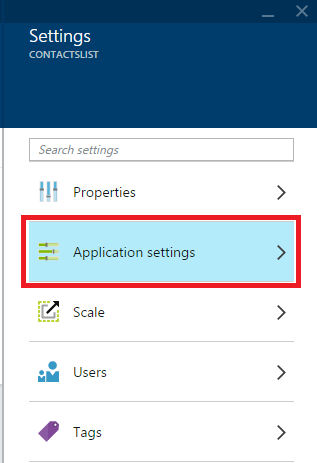
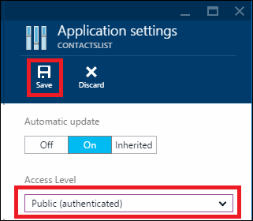

1. Navigate to the **API App** blade for the API app that you want to protect.

2. In the **API App** blade, click **Settings**, and then click **Application settings**.

	

	

3. In the **Application Settings** blade, change **Access Level** to **Public (authenticated)**, and then click **Save**.

	

