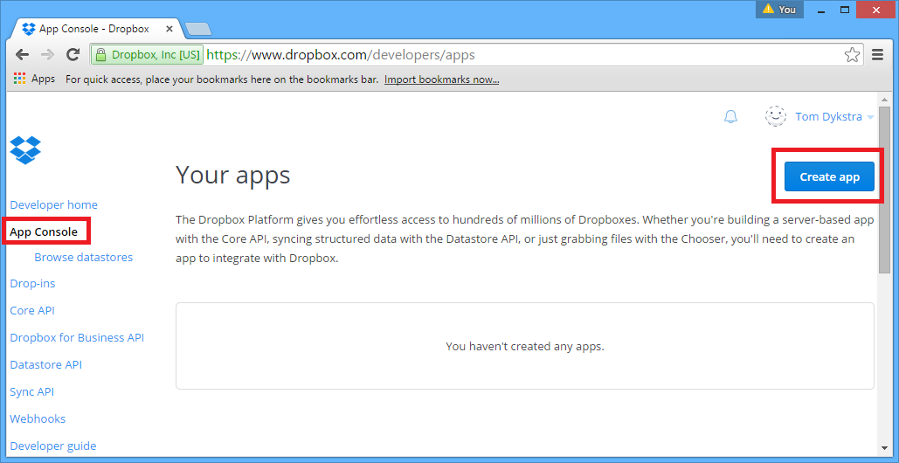
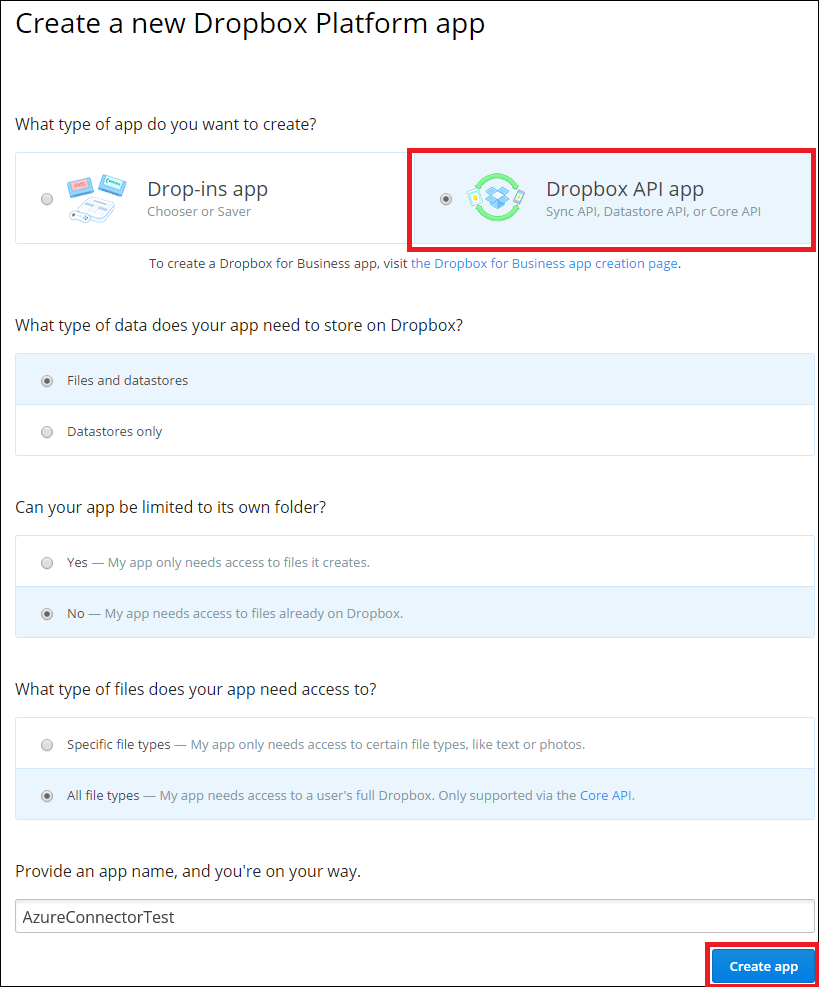
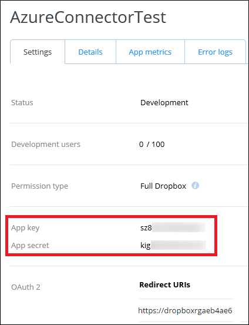

The following steps show the process for creating a Dropbox app using the Dropbox.com site. As the Dropbox.com site may change without notice, you might see differences in UI from what is shown.

1. Go to the [Dropbox developer portal](https://www.dropbox.com/developers/apps), click **App Console**, and then click **Create App**.

	 

2. Choose **Dropbox API app** and configure the other settings. 
 
	The file access options shown in the screenshot below will enable you to test access to your Dropbox account with a simple HTTP Get request if you have any files in your account. 

	The name of the Dropbox API app can be anything the Dropbox site will accept.

3. Click **Create app**.

	

	The next page shows the App key and App secret settings (named Client ID and Client secret in Azure) that you'll use for configuring your Azure Dropbox connector. 

	This page also has a field where you can enter a Redirect URI, the value of which you'll get in the next section.

	
