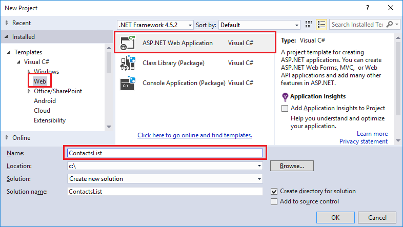
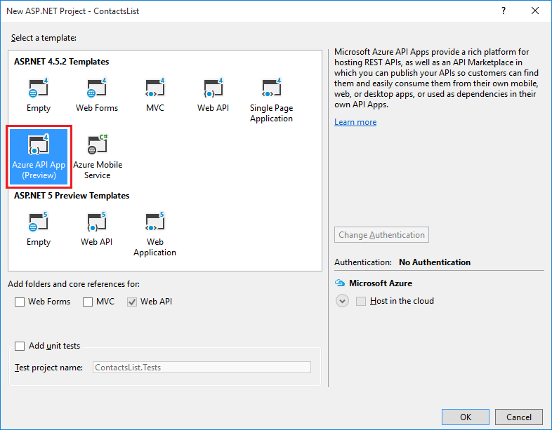

1. Open Visual Studio 2015 or Visual Studio 2013.

2. Select **File > New > Project**.

3. Select the **ASP.NET Web Application** template.

4. Make sure that the **Add Application Insights to Project** check box is cleared.

4. Enter a name for the project.

	

5. Click **OK**.

6. In the **New ASP.NET Project** dialog, select the **Azure API App** project template.

	

7. Click **OK** to generate the project.

Visual Studio creates a Web API project configured for deployment as an API app.
