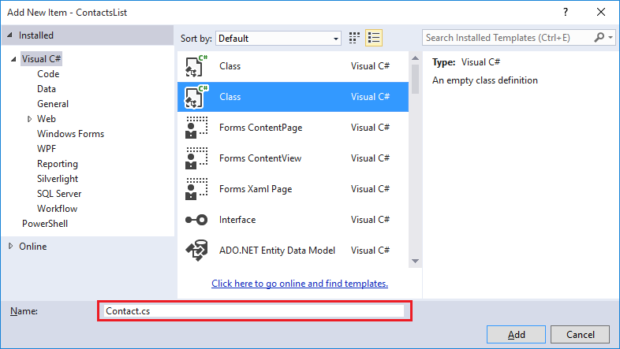
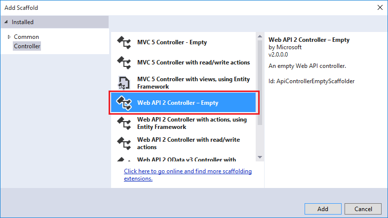
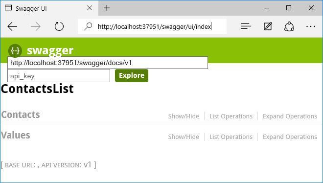
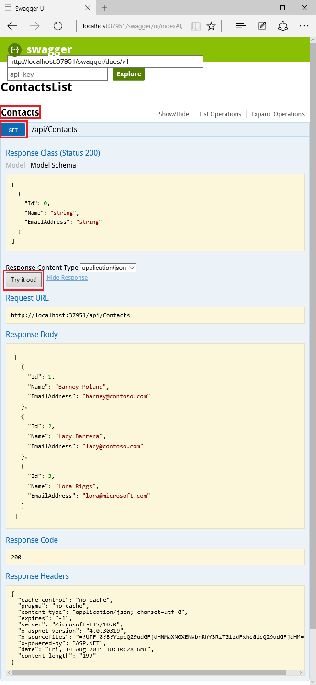

## Add Web API code

In the following steps you add code for a simple HTTP Get method that returns a hard-coded list of contacts. 

1. In Solution Explorer, right-click the **Models** folder and select **Add > Class**. 

	 

2. Name the new file *Contact.cs*. 

	 

3. Click **Add**.

4. Once the *Contact.cs* file has been created, replace the entire contents of the file with the following code. 

		namespace ContactsList.Models
		{
			public class Contact
			{
				public int Id { get; set; }
				public string Name { get; set; }
				public string EmailAddress { get; set; }
			}
		}

5. Right-click the **Controllers** folder, and select **Add > Controller**. 

	

6. In the **Add Scaffold** dialog, select the **Web API 2 Controller - Empty** option, and click **Add**. 

	

7. Name the controller **ContactsController**, and click **Add**. 

	

8. Once the ContactsController.cs file has been created, replace the entire contents of the file with the following code. 

		using ContactsList.Models;
		using System;
		using System.Collections.Generic;
		using System.Linq;
		using System.Net;
		using System.Net.Http;
		using System.Threading.Tasks;
		using System.Web.Http;
		
		namespace ContactsList.Controllers
		{
		    public class ContactsController : ApiController
		    {
		        [HttpGet]
		        public IEnumerable<Contact> Get()
		        {
		            return new Contact[]{
						new Contact { Id = 1, EmailAddress = "barney@contoso.com", Name = "Barney Poland"},
						new Contact { Id = 2, EmailAddress = "lacy@contoso.com", Name = "Lacy Barrera"},
	                	new Contact { Id = 3, EmailAddress = "lora@microsoft.com", Name = "Lora Riggs"}
		            };
		        }
		    }
		}

## Enable Swagger UI

By default, API App projects are enabled with automatic [Swagger](http://swagger.io/ "Official Swagger information") metadata generation, and when you use the **Add API App SDK** menu entry to convert a Web API project, an API test page is also enabled by default.  

However, the Azure API App new-project template disables the API test page. When you create your API app project by using the API app project template, do the following steps to enable the test page.

**Note:** If you deploy the API app as *public anonymous* and with the Swagger UI enabled, anyone will be able to use the Swagger UI to discover and call your APIs. 

1. Open the *App_Start/SwaggerConfig.cs* file, and search for **EnableSwaggerUI**:

	

2. Uncomment the following lines of code:

	        })
	    .EnableSwaggerUi(c =>
	        {

3. When you're done, the file should look like this:

	

## Test the Web API

To view the API test page, perform the following steps.

1. Run the app locally (CTRL+F5).

	The browser opens and displays an HTTP 403 error because the base URL is not a valid web page or API method URL for this project.
 
3.  Navigate to the Swagger page by adding `/swagger` to the end of the base URL. 

	

2. Click **Contacts > Get > Try it out**, and you see that the API is functioning and returns the expected result. 

	

3. In Visual Studio click **Debug > Stop Debugging**.
