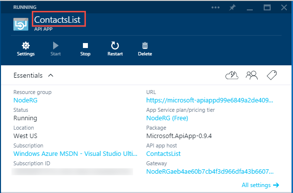
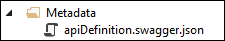

## API app metadata

This section provides additional information about API app metadata that you can customize.

Most of the properties in the *apiapp.json* file, and the files in the *Metadata* folder, affect the way an API app package is presented in the Azure Marketplace. The following sections explain which properties and files affect API apps when you deploy your code to an API app in your Azure subscription. 

### API app ID 

The `id` property determines the name of the API app.  For example:

		"id": "ContactsList",

### Namespace

Set the `namespace` property to the domain of your Azure Active Directory tenant. To find your domain, open your browser to the [Azure classic portal](https://manage.windowsazure.com/), browse **Active Directory**, and select the **Domains** tab. For example:

		"namespace": "contoso.onmicrosoft.com",

### Dynamic Swagger API definition

To provide a URL endpoint for a dynamic [Swagger](http://swagger.io/) API definition, store in the `endpoints.apiDefinition` property the relative URL of an API exposed by the API app which returns a Swagger 2.0 API definition on a GET request. For example:  

		"endpoints": {
		    "apiDefinition": "/swagger/docs/v1"
		}

### Static Swagger API definition

To provide a static [Swagger](http://swagger.io/) 2.0 API definition file, store the file in the *Metadata* folder and name the file *apiDefinition.swagger.json*

Leave `endpoints.apiDefinition` out of the *apiapp.json* file or set its value to null. If you include both an `endpoints.apiDefinition` URL and an *apiDefinition.swagger.json* file, the URL will take precedence and the file will be ignored.
 
### Other API app metadata

For more information about the *apiapp.json* file and the *Metadata* folder, see [Create an API app package](app-service-api-create-package.md). 

