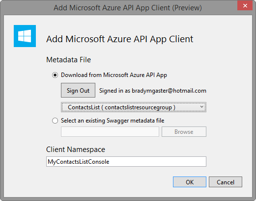

3. In **Solution Explorer**, right-click the project (not the solution) and select **Add > Azure API App Client**. 

	
	
3. In the **Add Azure API App Client** dialog, click **Download from Azure API App**. 

5. From the drop-down list, select the API app that you want to call. 

7. Click **OK**. 

	

	The wizard downloads the API metadata file and generates a typed interface for calling the API app.

	

	Once code generation is complete, you see a new folder in **Solution Explorer**, with the name of the API app. This folder contains the code that implements the client classes and data models. 

	
