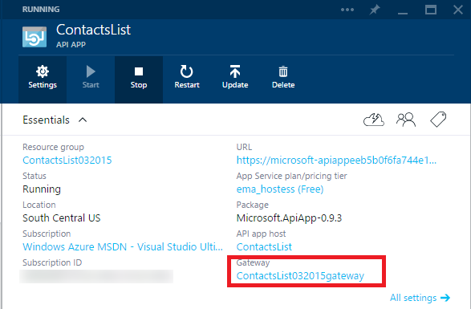
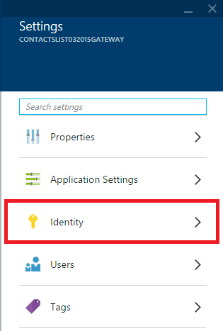
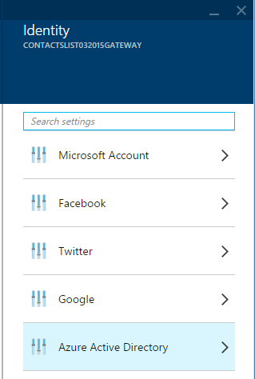
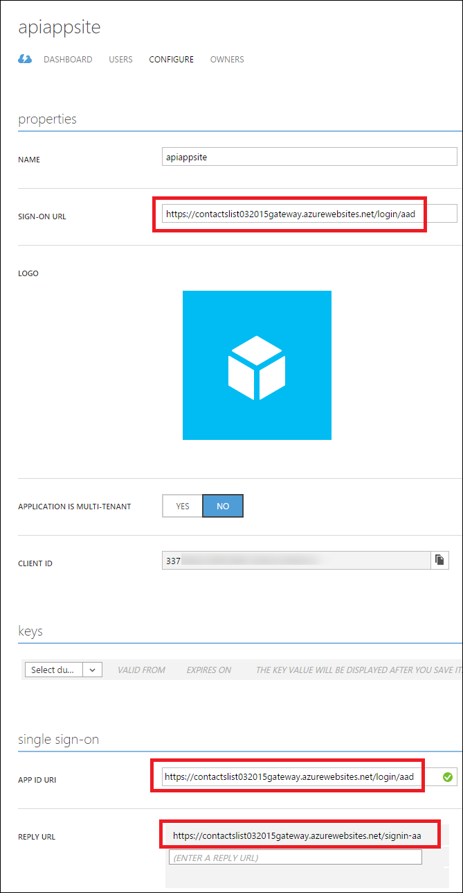

4. Navigate to your API app's gateway blade.

	

7. In the **Gateway** blade, click **Settings**, and then click **Identity**.

	

	

	From the **Identity** blade you can navigate to different blades for configuring authentication using Azure Active Directory and several other providers.

	
  
3. Choose the identity provider you want to use, and follow the steps in the corresponding article to configure your API app with that provider. These articles were written for mobile apps, but the procedures are the same for API apps. Some of the procedures require you to use the [Azure portal]. 

 - [Microsoft Account](../articles/app-service-mobile/app-service-mobile-how-to-configure-microsoft-authentication-preview.md)
 - [Facebook login](../articles/app-service-mobile/app-service-mobile-how-to-configure-facebook-authentication-preview.md)
 - [Twitter login](../articles/app-service-mobile/app-service-mobile-how-to-configure-twitter-authentication-preview.md)
 - [Google login](../articles/app-service-mobile/app-service-mobile-how-to-configure-google-authentication-preview.md)
 - [Azure Active Directory](../articles/app-service-mobile/app-service-mobile-how-to-configure-active-directory-authentication-preview.md)

As an example, the following screen shots show what you should see in the [Azure portal] pages and [Azure preview portal] blades after you have set up Azure Active Directory authentication.

In the Azure preview portal, The **Azure Active Directory** blade has a **Client ID** from the application you created in the Azure Active Directory tab of the Azure portal, and **Allowed Tenants** has your Azure Active Directory tenant (for example, "contoso.onmicrosoft.com").

In the Azure portal, the **Configure** tab for the application you created in the **Azure Active Directory** tab has the **Sign-on URL**, **App ID URI**, and **Reply URL** from the **Azure Active Directory** blade in the Azure preview portal.

(The Reply URL in the image shows the same URL twice, once with `http:` and once with `https:`.)
