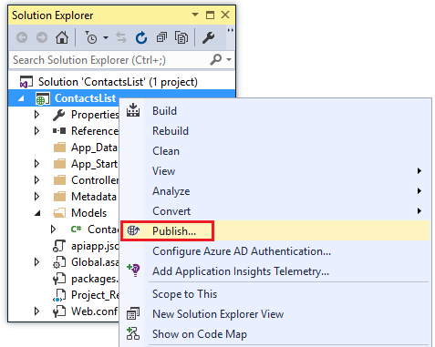
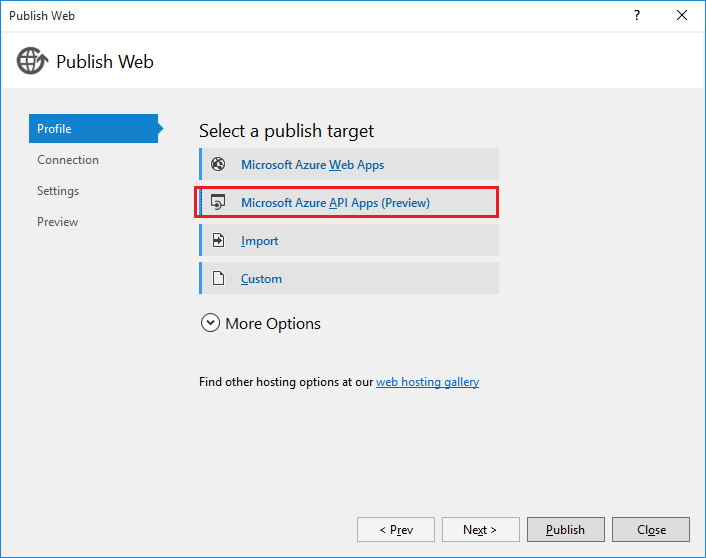
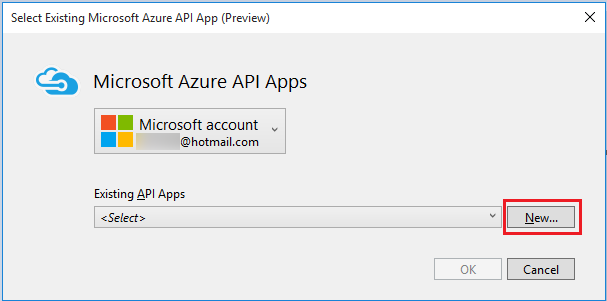
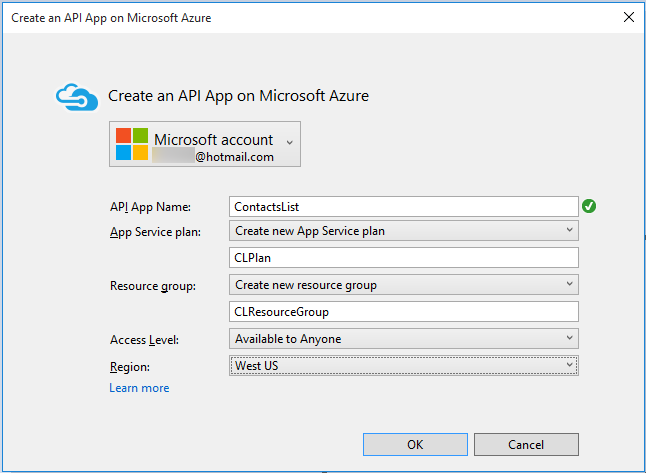
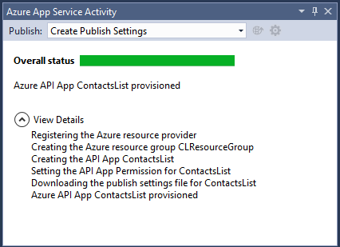

1. In **Solution Explorer**, right-click the project (not the solution) and click **Publish**. 

	

2. Click the **Profile** tab and click **Microsoft Azure API Apps (Preview)**. 

	

3. Click **New** to provision a new API App in your Azure subscription.

	

4. In the **Create an API App** dialog, enter the following:

	- For **API App Name**, enter the name you're using for this tutorial. 
	- If you have multiple Azure subscriptions, select the one you want to use.
	- For **App Service Plan**, select from your existing App Service plans, or select **Create new App Service plan** and enter the name of a new plan. 
	- For **Resource Group**, select from your existing resource groups, or select **Create new resource group** and enter a name. 
	- For **Access Level**, select **Available to Anyone**. You can restrict access later through the Azure preview portal.
	- For **Region**, select a region close to you.  

	

5. Click **OK** to create the API App in your subscription. 

	As this process can take a few minutes, Visual Studio displays a confirmation dialog.  

6. Click **OK** on the confirmation dialog. 
 
	The provisioning process creates the resource group and API App in your Azure subscription. Visual Studio shows the progress in the **Azure App Service Activity** window. 

	