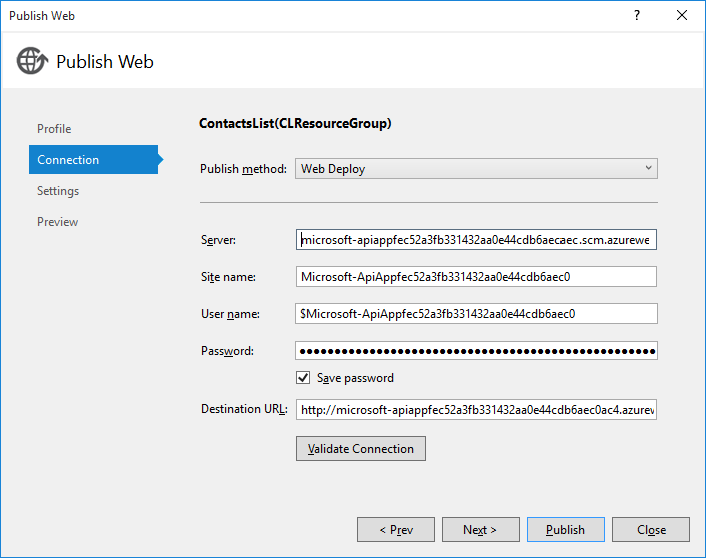
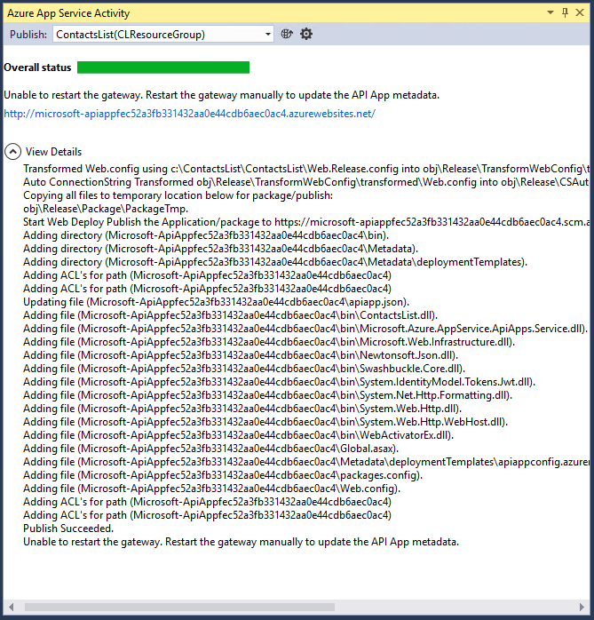
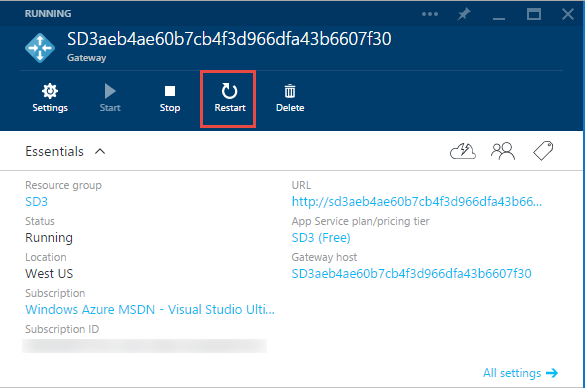

7. Right-click the API app project in **Solution Explorer** and select **Publish** to open the publish dialog. The publish profile that you created earlier should be pre-selected. 

9. Click **Publish** to begin the deployment process. 

	

	The **Azure App Service Activity** window shows the deployment progress. 

	

	During this deployment process, Visual Studio automatically tries to restart the *gateway*. The gateway is a web app that handles administrative functions for all API apps in a resource group, and it has to be restarted to recognize changes in an API app's API definition or *apiapp.json* file. 
 
	If you use another method to deploy an API app, or if Visual Studio fails to restart the gateway, you might have to restart the gateway manually. The following steps explain how to do that.

1. In your browser, go to the [Azure preview portal](https://portal.azure.com). 

2. Navigate to the **API app** blade for the API app that you deployed.

	For information about the **API app** blade, and how to find it, see [Manage API apps](../articles/app-service-api/app-service-api-manage-in-portal.md).

4. Click the **Gateway** link.

3. In the **Gateway** blade, click **Restart**.

	
