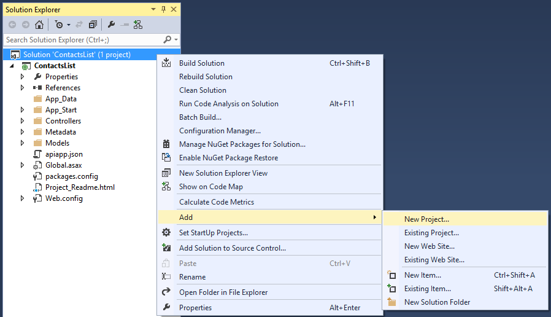
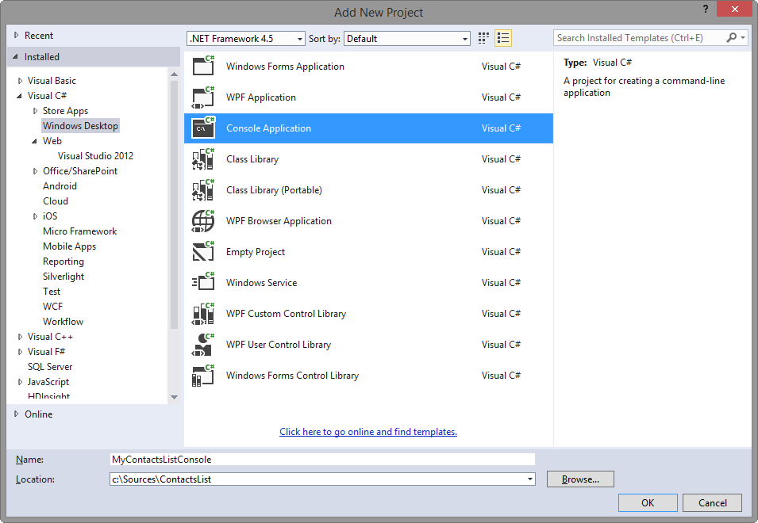

## Generate an API app client 

The API App tools in Visual Studio make it easy to generate C# code that calls to your Azure API Apps from desktop, store, and mobile apps. 

1. In Visual Studio, open the solution that contains the API app from the [Create API app](../article/app-service-api/app-service-dotnet-create-api-app.md) topic. 

2. From **Solution Explorer**, right-click the solution and select the **Add** > **New Project**.

	

3. In the **Add New Project** dialog, perform the following steps:

	1. Select the **Windows Desktop** category.
	
	2. Select the **Console Application** project template.
	
	3. Name the project.
	
	4. Click **OK** to generate the new project in your existing solution.
	
	

4. Right-click the newly created console application project and select **Add** > **Azure API App Client**. 

	
	
5. In the **Add Microsoft Azure API App Client** dialog, perform the following steps: 

	1. Select the **Download** option. 
	
	2. From the drop-down list, select the API app that you created earlier. 
	
	3. Click **OK**. 

	

	The wizard will download the API metadata file and generate a typed interface for invoking the API App.

	

	Once code generation is complete, you'll see a new folder in Solution Explorer, with the name of the API app. This folder contains the code that implements the client and data models. 

	

6. Open the **Program.cs** file from the project root and replace the **Main** method with the following code: 

		static void Main(string[] args)
	    {
	        var client = new ContactsList();
	
	        // Send GET request.
	        var contacts = client.Contacts.Get();
	        foreach (var c in contacts)
	        {
	            Console.WriteLine("{0}: {1} {2}",
	                c.Id, c.Name, c.EmailAddress);
	        }
	
	        // Send POST request.
			client.Contacts.Post(new Models.Contact
		    {
		        EmailAddress = "lkahn@contoso.com",
		        Name = "Loretta Kahn",
		        Id = 4
		    });
	
	        Console.WriteLine("Finished");
	        Console.ReadLine();
	    }

## Test the API app client

Once the API app has been coded, it's time to test the code.

1. Open **Solution Explorer**.

2. Right-click the console application you created in the previous section.

3. From the console application's context menu, select **Debug > Start new instance**. 

4. A console windows should open and display all of the contacts. 

	

5. Press **Enter** to dismiss the console window.          
