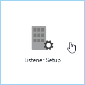
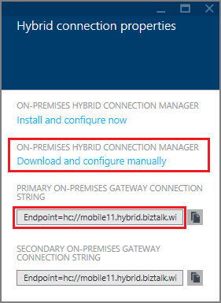
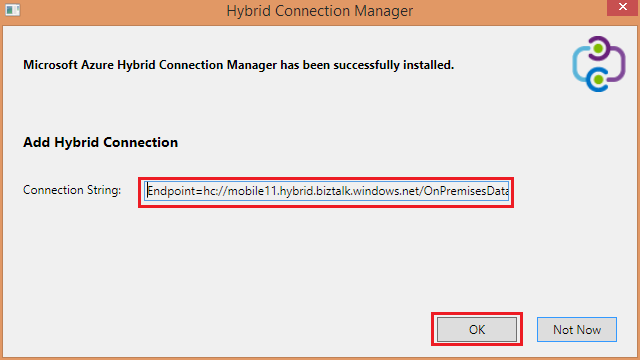
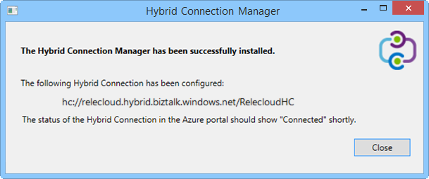

1. In the **Hybrid connections** blade, click the hybrid connection you just created, then click **Listener Setup**.
	
	
	
4. The **Hybrid connection properties** blade opens. Under **On-premises Hybrid Connection Manager**, choose **download and configure manually**, save the downloaded the HybridConnectionManager.msi package, and copy the the gateway connection string.
	
	
	
5. From an administrator command prompt, type the following command to start the installer:

		start HybridConnectionManager.msi
 
7. After the installer runs, click **Not now**, then browse to the %ProgramFiles%\Microsoft\HybridConnectionManager folder, run HCMConfigWizard.exe and click **Yes** in the **User Account Control** dialog.
		
7. Paste the hybrid connection string that you copied earlier and click **OK**. 
	
	
	
8. When the install completes, click **Close**.
	
	
	
	On the **Hybrid connections** blade, the **Status** column now shows **Connected**. 
	
	