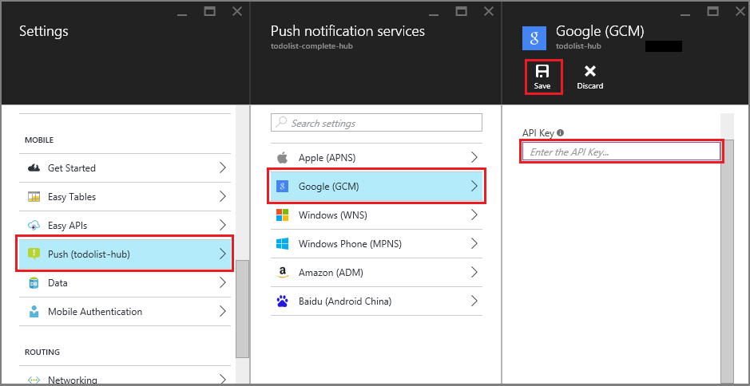

1. In the [Azure portal](https://portal.azure.com/), click **Browse All** > **App Services**, and then click your Mobile Apps back end. Under **Settings**, click **App Service Push**, and then click your notification hub name.
2. Go to **Google (GCM)**, enter the **Server Key** value that you obtained from Firebase in the previous procedure, and then click **Save**.

    

The Mobile Apps back end is now configured to use Firebase Cloud Messaging. This enables you to send push notifications to your app running on an Android device, by using the notification hub.
