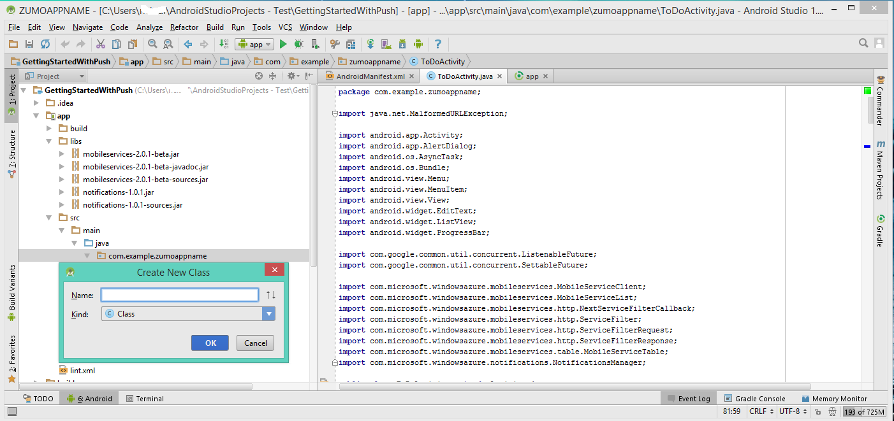

1. In your **app** project, open the file `AndroidManifest.xml`. In the code in the next two steps, replace _`**my_app_package**`_ with the name of the app package for your project, which is the value of the `package` attribute of the `manifest` tag.

2. Add the following new permissions after the existing `uses-permission` element:

        <permission android:name="**my_app_package**.permission.C2D_MESSAGE"
            android:protectionLevel="signature" />
        <uses-permission android:name="**my_app_package**.permission.C2D_MESSAGE" />
        <uses-permission android:name="com.google.android.c2dm.permission.RECEIVE" />
        <uses-permission android:name="android.permission.GET_ACCOUNTS" />
        <uses-permission android:name="android.permission.WAKE_LOCK" />

3. Add the following code after the `application` opening tag:

        <receiver android:name="com.microsoft.windowsazure.notifications.NotificationsBroadcastReceiver"
            						 	android:permission="com.google.android.c2dm.permission.SEND">
            <intent-filter>
                <action android:name="com.google.android.c2dm.intent.RECEIVE" />
                <category android:name="**my_app_package**" />
            </intent-filter>
        </receiver>

4. Open the file *ToDoActivity.java*, and add the following import statement:

		import com.microsoft.windowsazure.notifications.NotificationsManager;

5. Add the following private variable to the class: replace _`<PROJECT_NUMBER>`_ with the Project Number assigned by Google to your app in the preceding procedure:

		public static final String SENDER_ID = "<PROJECT_NUMBER>";

6. Change the definition of the *MobileServiceClient* from **private** to **public static**, so it now looks like this:

		public static MobileServiceClient mClient;

7. Next we need to add a new class to handle notifications. In the Project Explorer, open the **src** => **main** => **java** nodes, and right-click the  package name node: click **New**, then click **Java Class**.

8. In **Name** type `MyHandler`, then click **OK**.

	

9. In the MyHandler file, replace the class declaration with

		public class MyHandler extends NotificationsHandler {

10. Add the following import statements for the `MyHandler` class:

		import com.microsoft.windowsazure.notifications.NotificationsHandler;
		import android.app.NotificationManager;
		import android.app.PendingIntent;
		import android.content.Context;
		import android.content.Intent;
		import android.os.AsyncTask;
		import android.os.Bundle;
		import android.support.v4.app.NotificationCompat;

11. Next add this member to the `MyHandler` class:

		public static final int NOTIFICATION_ID = 1;

12. In the `MyHandler` class, add the following code to override the **onRegistered** method, which registers your device with the mobile service Notification Hub.

		@Override
		public void onRegistered(Context context,  final String gcmRegistrationId) {
		    super.onRegistered(context, gcmRegistrationId);

		    new AsyncTask<Void, Void, Void>() {

		    	protected Void doInBackground(Void... params) {
		    		try {
		    		    ToDoActivity.mClient.getPush().register(gcmRegistrationId);
		    		    return null;
	    		    }
	    		    catch(Exception e) {
			    		// handle error    		    
	    		    }
					return null;  		    
	    		}
		    }.execute();
		}

13. In the `MyHandler` class, add the following code to override the **onReceive** method, which causes the notification to display when it is received.

		@Override
		public void onReceive(Context context, Bundle bundle) {
        		String msg = bundle.getString("message");

        		PendingIntent contentIntent = PendingIntent.getActivity(context,
                		0, // requestCode
                		new Intent(context, ToDoActivity.class),
                		0); // flags

        		Notification notification = new NotificationCompat.Builder(context)
                		.setSmallIcon(R.drawable.ic_launcher)
                		.setContentTitle("Notification Hub Demo")
                		.setStyle(new NotificationCompat.BigTextStyle().bigText(msg))
                		.setContentText(msg)
                		.setContentIntent(contentIntent)
                		.build();

        		NotificationManager notificationManager = (NotificationManager)
                		context.getSystemService(Context.NOTIFICATION_SERVICE);
        		notificationManager.notify(NOTIFICATION_ID, notification);
		}

14. Back in the TodoActivity.java file, update the **onCreate** method of the *ToDoActivity* class to register the notification handler class. Make sure to add this code after the *MobileServiceClient* is instantiated.

		NotificationsManager.handleNotifications(this, SENDER_ID, MyHandler.class);

    Your app is now updated to support push notifications.
