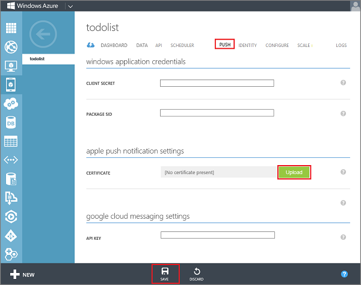

After you have registered your app with APNS and configured your project, you must next configure your mobile service to integrate with APNS.

1. In Keychain Access, right-click the quickstart app's new certificate in **Keys** or **My Certificates**, click **Export**, name your file QuickstartPusher, select the **.p12** format, then click **Save**.

   	

    Make a note of the file name and location of the exported certificate.

>[AZURE.NOTE] This tutorial creates a QuickstartPusher.p12 file. Your file name and location might be different.

2. Log on to the [Azure Preview Portal], click **Mobile Services**, and then click your app.

   	

3. Click the **Push** tab and click **Upload**.

   	

	This displays the Upload Certificate dialog.

4. Click **File**, select the exported certificate QuickstartPusher.p12 file, enter the **Password**, make sure that the correct **Mode** is selected (either Dev/Sandbox or Prod/Production), click the check icon, then click **Save**.

   	

    > [AZURE.NOTE] This tutorial uses developement certificates.

Your App Service mobile app is now configured to work with APNS.

<!-- URLs. -->
[Azure Management Portal]: https://portal.azure.com/
