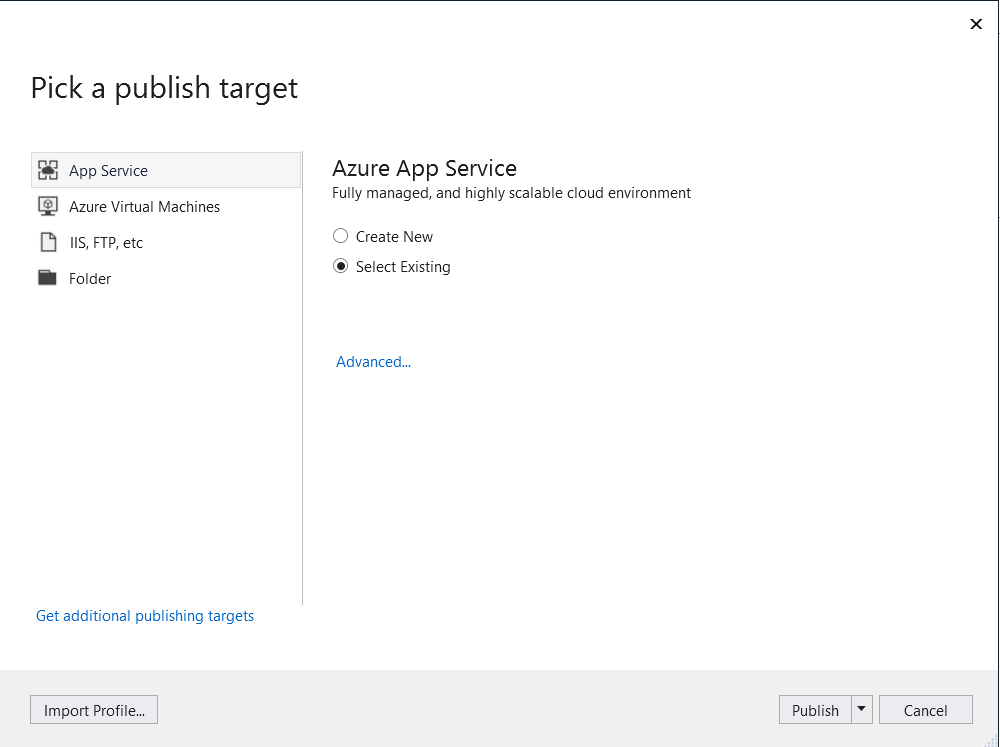

1. Download the client SDK quickstarts for the following platforms:
    
    [iOS (Objective-C)](https://github.com/Azure/azure-mobile-apps-quickstarts/tree/master/client/iOS)  
    [iOS (Swift)](https://github.com/Azure/azure-mobile-apps-quickstarts/tree/master/client/iOS-Swift)  
    [Android (Java)](https://github.com/Azure/azure-mobile-apps-quickstarts/tree/master/client/android)  
    [Xamarin.iOS](https://github.com/Azure/azure-mobile-apps-quickstarts/tree/master/client/xamarin.iOS)  
    [Xamarin.Android](https://github.com/Azure/azure-mobile-apps-quickstarts/tree/master/client/xamarin.android)  
    [Xamarin.Forms](https://github.com/Azure/azure-mobile-apps-quickstarts/tree/master/client/xamarin.forms)  
    [Cordova](https://github.com/Azure/azure-mobile-apps-quickstarts/tree/master/client/cordova)  
    [Windows (C#)](https://github.com/Azure/azure-mobile-apps-quickstarts/tree/master/client/windows-uwp-cs)  

    > [!NOTE]
    > If you use the iOS project you need to download "azuresdk-iOS-\*.zip" from [latest GitHub release](https://github.com/Azure/azure-mobile-apps-ios-client/releases/latest). Unzip and add the `MicrosoftAzureMobile.framework` file to the project's root.
    >

2. You will have to add a database connection or connect to an existing connection. First, determine whether you’ll create a data store or use an existing one.

    - **Create a new data store**: If you’re going to create a data store, use the following quickstart:

        [Quickstart: Getting started with single databases in Azure SQL Database](https://docs.microsoft.com/azure/sql-database/sql-database-single-database-quickstart-guide)

    - **Existing data source**: Follow the instructions below if you want to use an existing database connection

        1. SQL Database Connection String format - 
        `Data Source=tcp:{your_SQLServer},{port};Initial Catalog={your_catalogue};User ID={your_username};Password={your_password}`

           **{your_SQLServer}** Name of the server, this can be found in the overview page for your database and is usually in the form of “server_name.database.windows.net”.
            **{port}** usually 1433.
            **{your_catalogue}** Name of the database.
            **{your_username}** User name to access your database.
            **{your_password}** Password to access your database.

            [Learn more about SQL Connection String format](https://docs.microsoft.com/dotnet/framework/data/adonet/connection-string-syntax#sqlclient-connection-strings)

        2. Add the connection string to your **mobile app**
            In App Service, you can manage connection strings for your application by using the **Configuration** option in the menu.

            To add a connection string:

            1. Click on the **Application settings** tab.

            2. Click on **[+] New connection string**.

            3. You will need to provide **Name**, **Value** and **Type** for your connection string.

            4. Type **Name** as `MS_TableConnectionString`

            5. Value should be the connecting string you formed in the step before.

            6. If you are adding a connection string to a SQL Azure database choose **SQLAzure** under **type**.

3. Azure Mobile Apps has SDKs for .NET and Node.js backends.

   - **Node.js backend**
    
     If you’re going to use Node.js quickstart app, follow the instructions below.
     
        1. Create a new API - You can either make changes right in the Azure portal or modify the code locally in your development environment and then publish to Azure. Click on the `App Service Editor (Preview)` under `Development Tools` menu which provides an in-browser editing experience for your app code.
        
        2. Click on `Go` and once the App Service Editor opens, you have full control over the source code. Assuming you have already installed express and azure-mobile-apps package with npm install command, click on the api folder under WWWROOT to create or edit custom API. Make your changes to the code file and the changes are saved automatically.
        
        3. You have full control on the Azure SQL Database used to store the application data. You can easily create new tables in the database.
 
   - **.NET backend**
    
        If you’re going to use .NET quickstart app, follow the instructions below.

        1. Download the Azure Mobile Apps .NET server project from the [azure-mobile-apps-quickstarts repository](https://github.com/Azure/azure-mobile-apps-quickstarts/tree/master/backend/dotnet/Quickstart).

        2. Build the .NET server project locally in Visual Studio.

        3. In Visual Studio, open Solution Explorer, right-click on `ZUMOAPPNAMEService` project, click **Publish**, you will see a `Publish to App Service` window. If you are working on Mac, check out other ways to deploy the app [here](https://docs.microsoft.com/azure/app-service/deploy-local-git).
        
           

        4. Select **App Service** as publish target, then click **Select Existing**, then click the **Publish** button at the bottom of the window.

        5. You will need to log into Visual Studio with your Azure subscription first. Select the `Subscription`, `Resource Group`, and then select the name of your app. When you are ready, click **OK**, this will deploy the .NET server project that you have locally into the App Service backend. When deployment finishes, you will be redirected to `http://{zumoappname}.azurewebsites.net/` in the browser.                   
