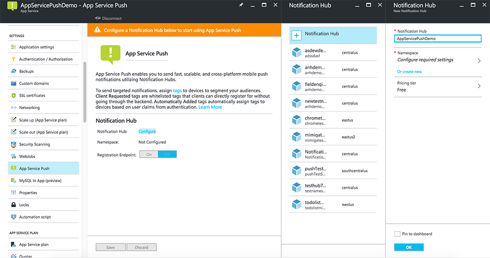

The Mobile Apps feature of Azure App Service uses [Azure Notification Hubs] to send pushes, so you will be configuring a notification hub for your mobile app.

1. In the [Azure portal], go to **App Services**, and then select your app back end. Under **Settings**, select **Push**.
2. To add a notification hub resource to the app, select **Connect**. You can either create a hub or connect to an existing one.

    

Now you have connected a notification hub to your Mobile Apps back-end project. Later you configure this notification hub to connect to a platform notification system (PNS) to push to devices.

[Azure portal]: https://portal.azure.com/
[Azure Notification Hubs]: https://azure.microsoft.com/documentation/articles/notification-hubs-push-notification-overview/
