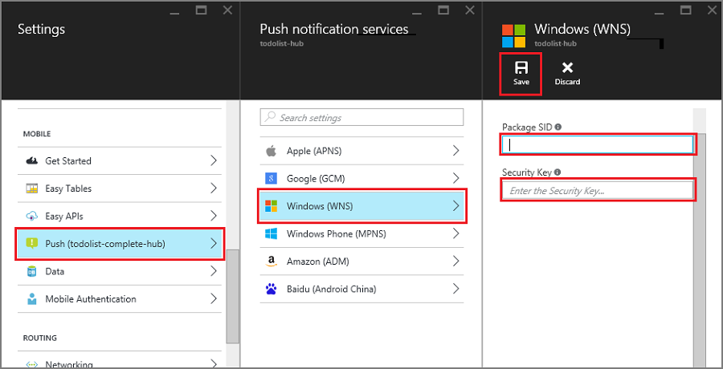

1. In the [Azure portal](https://portal.azure.com/), select **Browse All** > **App Services**. Then select your Mobile Apps back end. Under **Settings**, select **App Service Push**. Then select your notification hub name.
2. Go to **Windows (WNS)**. Then enter the **Security key** (client secret) and **Package SID** that you obtained from the Live Services site. Next, select **Save**.

    

Your back end is now configured to use WNS to send push notifications.
