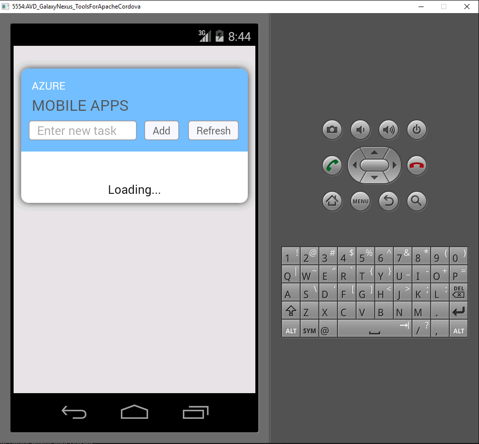

1. Visit the [Azure Portal]. Click **Browse All** > **Mobile Apps** > the backend that you just created. In the mobile
app settings, click **Quickstart** > **Cordova**. Under **Configure your client application**, select **Create a New App**,
then click **Download**. This downloads a complete Cordova project for an app pre-configured to connect to your backend.

2. Unpack the downloaded ZIP file to a directory on your hard drive, navigate to the solution file (.sln) and open it using Visual Studio.

5. In Visual Studio, choose the solution platform (Android, iOS or Windows) from the drop-down next to the start arrow, then select a specific deployment device or emulator by clicking the drop-down on the green arrow. Note that you can use default Android platform with the Ripple emulator. More advanced tutorials will require you to select a supported device or emulator. 

6. Press F5 or click the green arrow to build and and run your Cordova app. If you see a security dialog in the emulator requesting access to the network, accept it.   

7. After the the app is started on the device or emulator, type meaningful text in *Enter new text*, such as _Complete the tutorial_ and then click the *Add* button. This sends a POST request to the
Azure backend you deployed earlier. The backend inserts data from the request is into the TodoItem table in the SQL Database, and returns information about the newly stored items back to the mobile app. The mobile app displays this data in the list.

    
    
8. Repeate the previous three steps for each device platform that you plan to support.

[Azure Portal]: https://portal.azure.com/
