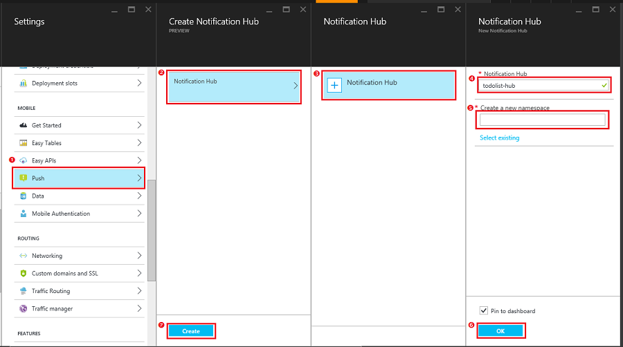

Follow these steps to create a new notification hub to use for push notifications. If you already have a notification hub, you can also connect it to your Mobile App backend. 

1. In the [Azure Portal], click **Browse** > **App Services**, then click your Mobile App backend > **All settings**, then under **Mobile** click **Push** > **Notification Hub**.

2. Click **+Notification Hub**, type a new **Notification Hub** name, which can be the same as your Mobile App backend, type a new namespace name or use an existing one, then click **OK** and finally **Create**.

	

	This creates a new notification hub and connects it to your mobile app. If you have an existing notification hub, you can choose to connect it to your Mobile App backend instead of creating a new one.

Now you have connected a notification hub to your Mobile App backend. Later you will configure this notification hub to connect to a platform notification service (PNS) that sends push notifications to the native device.

[Azure Portal]: https://portal.azure.com/