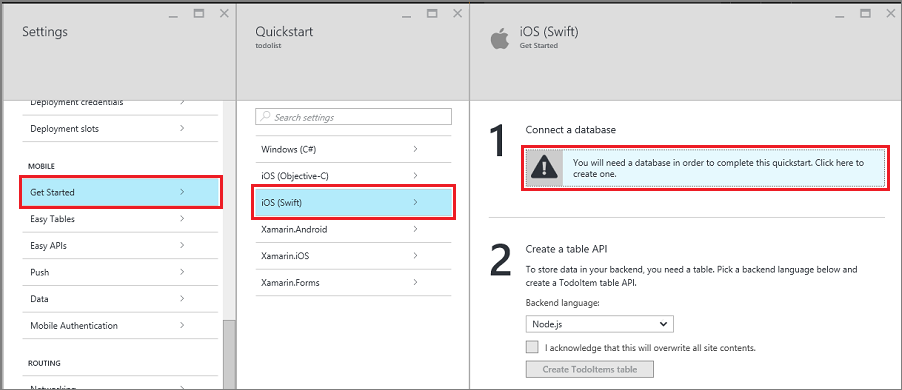

1. Sign in at the [Azure portal].
2. Select **+NEW** > **Web + Mobile** > **Mobile App**, and then provide a name for your Mobile Apps back end.
3. For **Resource Group**, select an existing resource group, or create a new one (by using the same name as your app). 
4. For **App Service plan**, the default plan (in the [Standard tier](https://azure.microsoft.com/pricing/details/app-service/)) is selected. You can also  select a different plan, or [create a new one](../articles/app-service/app-service-plan-manage.md#create-an-app-service-plan). 

   The App Service plan's settings determine the [location, features, cost, and compute resources](https://azure.microsoft.com/pricing/details/app-service/) associated with your app. For more about App Service plans and how to create a new plan in a different pricing tier and in your desired location, see [Azure App Service plans in-depth overview](../articles/app-service/overview-hosting-plans.md).
   
5. Select **Create**. This step creates the Mobile Apps back end. 
6. In the **Settings** pane for the new Mobile Apps back end, select **Quick start** > your client app platform > **Connect a database**. 
   
   
7. In the **Add data connection** pane, select **SQL Database** > **Create a new database**. Enter the database name, choose a pricing tier, and then select **Server**. You can reuse this new database. If you already have a database in the same location, you can instead choose **Use an existing database**. We don't recommend the use of a database in a different location, due to bandwidth costs and higher latency.
   
   
8. In the **New server** pane, enter a unique server name in the **Server name** box, provide a login and password, select **Allow Azure services to access server**, and select **OK**. This step creates the new database.
9. Back in the **Add data connection** pane, select **Connection string**, enter the login and password values for your database, and select **OK**. 

   Wait a few minutes for the database to be deployed successfully before you proceed.

<!-- URLs. -->
[Azure portal]: https://portal.azure.com/
