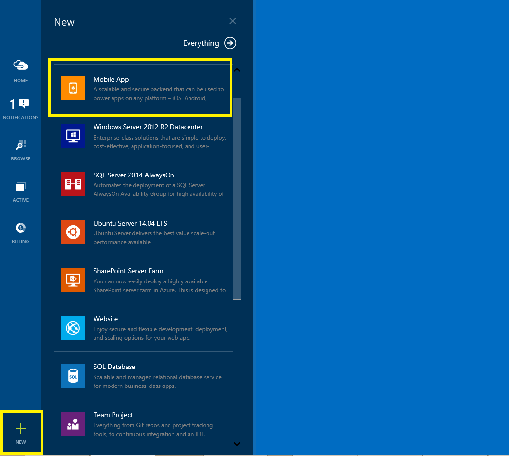
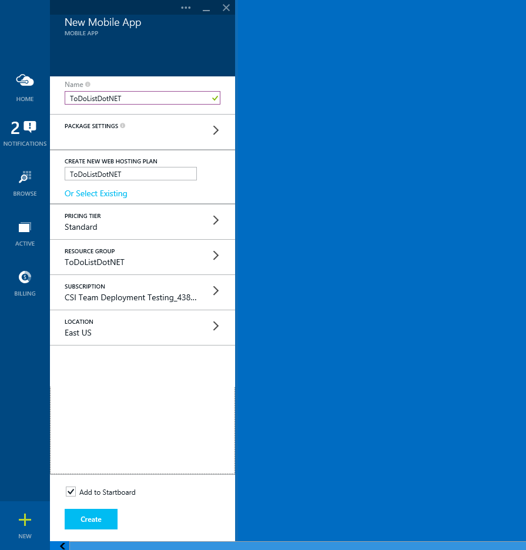
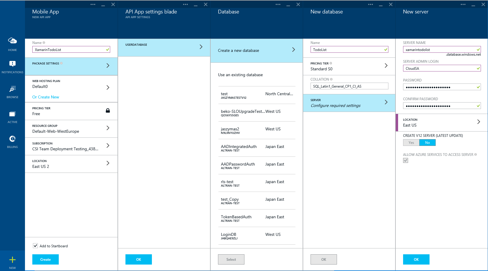

Follow these steps to create a new mobile service.

1.	Log into the [Azure Portal]. In the bottom left of the window, click **+NEW**. Scroll until you see the **Mobile App** item.
	

	This displays the **Create a Mobile Service** dialog.

2.	In the **New Mobile App** section, type a hosting plan name for the new mobile service in the **CREATE NEW WEB HOSTING PLAN** textbox, select a new **PRICING TIER**, create a new **RESOURCE GROUP**, select a **SUBSCIRPTION**, and choose your **LOCATION**. Then, click **CREATE** at the bottom of the page.
	

	This displays the **Specify database settings** page.

	> [AZURE.NOTE] As part of this tutorial, you create a new SQL Database instance and server. You can reuse this new database and administer it as you would any other SQL Database instance. If you already have a database in the same region as the new mobile service, you can instead choose **Use existing Database** and then select that database. The use of a database in a different region is not recommended because of additional bandwidth costs and higher latencies.

3.	In **Package Settings**, select **USERDATABASE**, you can choose an existing database or create a new one. To Create a new database, type the name of the new database, then type **Login name**, which is the administrator login name for the new SQL Database server, type and confirm the password, and click the ok button to complete the process.
	

You have now created a new mobile service that can be used by your mobile apps.

<!-- URLs. -->
[Azure Portal]: https://portal.azure.com/
