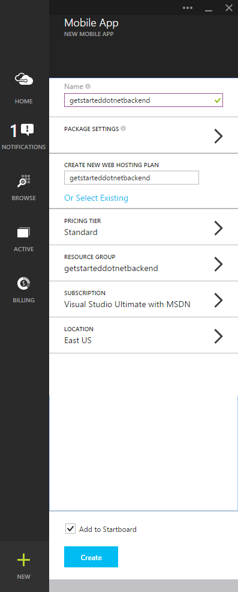

Follow these steps to create a new mobile app.

1. Log into the [Azure Portal]. In the top left of the window, click **+NEW**. Scroll until you see the **Mobile App** item.

    

    This displays the **New Mobile App** blade.

2. Type a name for your Mobile App. It must be at least 8 characters long.  

7. Select a location. In this tutorial, we use **South Central US**.

    > [AZURE.NOTE] As part of this tutorial, you create a new SQL Database instance and server. You can reuse this new database and administer it as you would any other SQL Database instance. If you already have a database in the same location as the new mobile app backend, you can instead choose **Use existing Database** and then select that database. The use of a database in a different location is not recommended because of additional bandwidth costs and higher latencies.

3. Select your app service plan.

4. Create a new resource group with the same name as your mobile app.

5. In **Package Settings**, select **USERDATABASE**, you can choose an existing database or create a new one. For creating a new database, type the name of the new **database**, create a new **server**, type the name of that server, then choose a **login name**, which is the administrator login name for the new SQL Database server, type and confirm the password, and click the ok button to complete the process. If selecting an existing database, you will need to provide a **Server Administrator Password**.

    

8. Select a Pricing Tier. In this tutorial, we use **Standard 1**.

    Your new mobile app settings page will now look something like this:

    

9. Click the **Create** button at the bottom of the blade and you should see it starting deployment in the notifications window.

You have now created a new mobile app backend that can be used by your mobile apps.

> [AZURE.NOTE] After your mobile app is created, navigate in the portal to the sql server you just created (be sure to select the server and not the azure sql db). From there, click the settings part, expand the firewall part, and change the "Allow access to Azure services". If you don't do this, your application won't work.

<!-- URLs. -->
[Azure Portal]: https://portal.azure.com/
