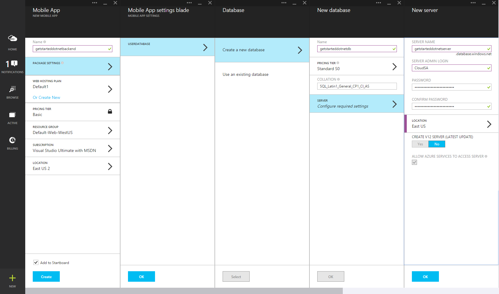

Follow these steps to create a new Mobile App backend.

1. Log into the [Azure Portal].

2. In the top left of the window, click the **+NEW** button > **Web + Mobile** > **Mobile App**, then provide a name for your Mobile App backend.

3. In the **Resource Group** box, enter the same name as your app.

4. The Default App Service plan will be selected.  If you wish to change your App Service plan, you can do so by clicking on the App Service Plan > **+ Create New**.  Provide a name of the new App Service plan and select an appropriate location.  Click the Pricing tier and select an appropriate pricing tier for the service. Select **View all** to view more pricing options, such as **Free** and **Shared**.  Once you have selected the pricing tier, click the **Select** button.  Back in the **App Service plan** blade, click **OK**.

5. Click **Create**. This creates a Mobile App backend where you will later deploy your server project.  Provisioning a Mobile App backend can take a couple of minutes.  Once the Mobile App backend is provisioned, the portal will open the **Settings** blade for the Mobile App backend.  In the next step, you will create a new SQL database.

    > [AZURE.NOTE] As part of this tutorial, you create a new SQL Database instance and server. You can reuse this new database and administer it as you would any other SQL Database instance. If you already have a database in the same location as the new mobile app backend, you can instead choose **Use an existing database** and then select that database. The use of a database in a different location is not recommended because of additional bandwidth costs and higher latencies.

6. In the new Mobile App backend, click **Settings** > **Mobile App** > **Data** > **+Add**.

7. In the **Add data connection** blade, click **SQL Database - Configure required settings** > **Create a new database**.  Enter the name of the new database in the **Name** field.

8. Click **Server**.  In the **New server** blade, enter a unique server name in the **Server name** field, and provide a suitable **Server admin login** and **Password**.  Ensure **Allow azure services to access server** is checked.  Click on **OK**.

    

9. On the **New database** blade, click on **OK**.

10. Back on the **Add data connection** blade, select **Connection string**, enter the login and password that you just provided when creating the database.  If you use an existing database, provide the login credentials for that database.  Once entered, click **OK**.

11. Back on the **Add data connection** blade again, click on **OK** to create the database.

Creation of the database can take a few minutes.  Use the **Notifications** area to monitor the progress of the deployment.  Do not progress until the database has been deployed sucessfully.

You have now provisioned an Azure Mobile App backend that can be used by your mobile client applications. Next, you will download a server  project for a simple "todo list" backend and publish it to Azure.

<!-- URLs. -->
[Azure Portal]: https://portal.azure.com/
