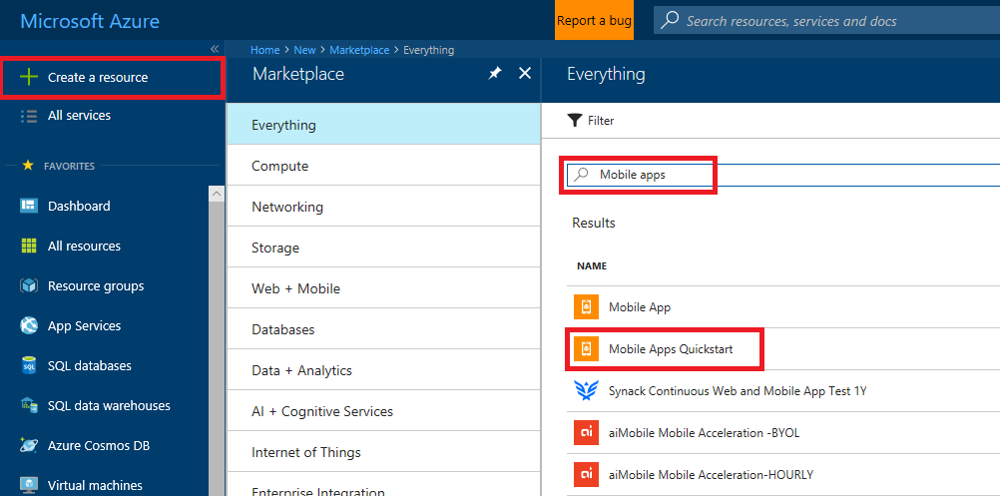

1. Log in at the [Azure Portal].

2. Click **+NEW** and type **Mobile Apps** in _Search the marketplace_. Select **Mobile Apps Quickstart** and click **Create**.

	

3. For the **Resource Group**, select an existing resource group, or create a new one (using the same name as your app.) 
 
4. Click **Create**. Wait a few minutes for the service to be deployed successfully before proceeding.

<!-- URLs. -->
[Azure Portal]: https://portal.azure.com/
