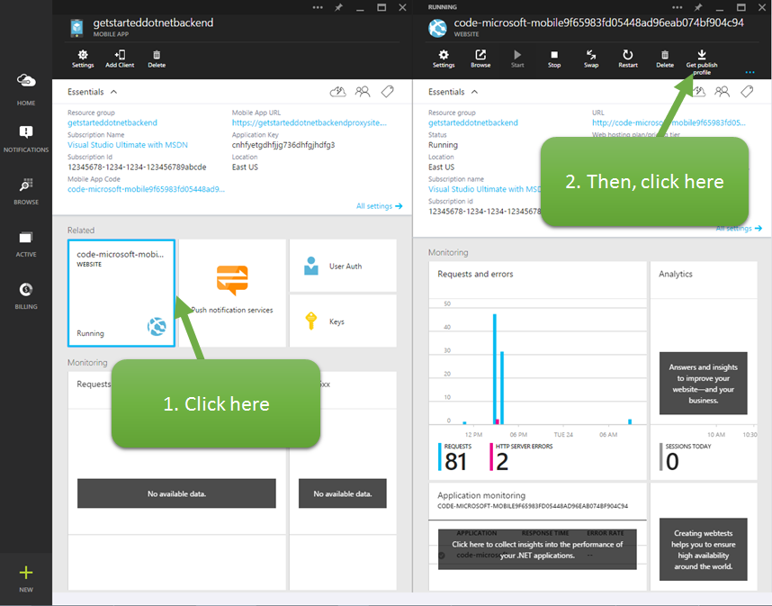
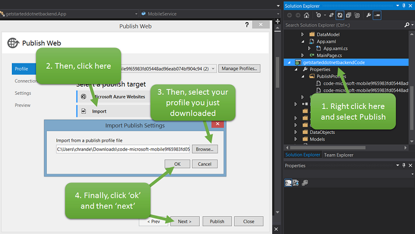

After testing the client app against the local mobile app, the final stage of this tutorial is to publish the mobile app backend to Azure and run the app against the live service.

> [AZURE.NOTE] This procedure shows how to publish your mobile app backend using Visual Studio tools. You can also publish your .NET backend using source control.

1. Go to your mobile app in the portal, and look for the **Related** section for a web app which will be named like `<your app name>-code`. Click on that part and it will show the **web app** blade which contains a link at the top called **Get Publish Profile**. Click that link and save it somewhere to access later.

   <!--todo: new screenshot when web app labels replace website in Ibiza-->
   

2. In Solution Explorer, right-click the mobile app project (it is your app name with "Service" appended), click **Publish**, then in the **Publish Web** dialog box click **Import**. From there, select your file you just downloaded. Click **OK** and then **Next**.

   

3. Click **Validate connection** to verify that publishing is correctly configured, then click **Publish**.

   

   After publishing succeeds, you will see the confirmation page that the mobile app backend is up and running in Azure. Your VS output window will also show success.
