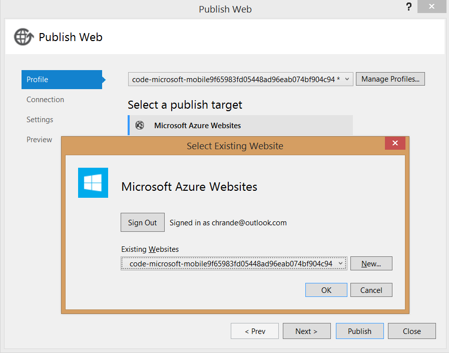

After testing the client app against the local mobile app, the final stage of this tutorial is to publish the mobile service to Azure and run the app against the live service.

>[AZURE.NOTE] This procedure shows how to publish your mobile service by using Visual Studio tools. You can also publish your .NET backend mobile service by using source control.

1. In Solution Explorer, right-click the mobile app project, click **Publish**, then in the **Publish Web** dialog box click **Microsoft Azure Websites**.

2. Sign in with your Azure account credentials, select your service from **Existing Websites**, and click **OK**. Visual Studio downloads your publish settings directly from Azure.

>[AZURE.NOTE] Your website name for your backend is code-microsoft-mobile<GUID>. Choose this name for your publish target. 
	

3. Click **Validate connection** to verify that publishing is correctly configured, then click **Publish**.

	

	After publishing succeeds, you will again see the confirmation page that the mobile service is up and running, this time in Azure.
