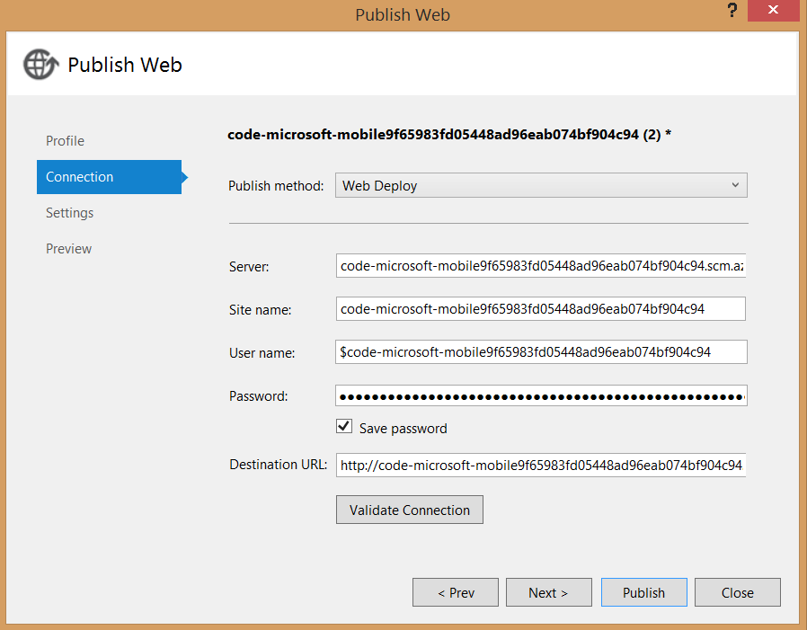

After testing the client app against the local mobile app, the final stage of this tutorial is to publish the mobile app backend to Azure and run the app against the live service.

> [AZURE.NOTE] This procedure shows how to publish your mobile app backend using Visual Studio tools. You can also publish your .NET backend using source control.

1. In Solution Explorer, right-click the mobile app code project (it is your app name with "Service" appended) and select **Publish**. 

	

2. In the **Publish Web** dialog box, select **Azure Mobile App** as the Publish Target. In the dialog that appears, select your existing mobile app, which will be your mobile app name appended with "code".

    

3. Click **Validate connection** to verify that publishing is correctly configured, then click **Publish**.

	

   After publishing succeeds, you will see the confirmation page that the mobile app backend is up and running in Azure. Your Visual Studio output window will also show success.
