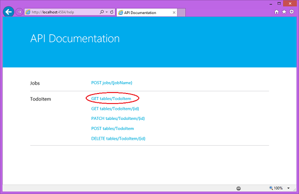
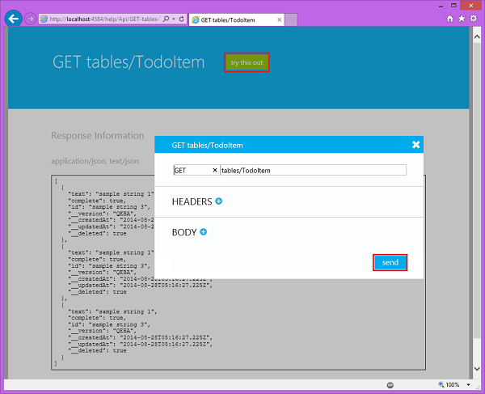
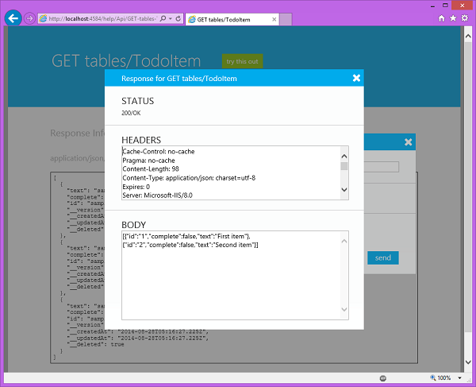

1. In Visual Studio in Solution Explorer, right click the service project and click **Start new instance** under the **Debug** context menu.

    Visual Studio opens the default web page for your service. By default, Visual Studio hosts your mobile app backend locally in IIS Express.

2. Right-click the tray icon for IIS Express on the Windows taskbar and verify that your mobile app backend has started.

	 

3. On the start page of your .NET backend, click **try it out**.

    This displays the API documentation page, which you can use to test the Mobile App.

	>[AZURE.NOTE]Authentication is not required to access this page when running locally. When running in Azure, you must supply the application key as the password (with no username) to access this page.

4. Click the **GET tables/TodoItem** link.

	
   	
	This displays the GET response page for the API.

5. Click **try this out** and then click **send**.
 
	

	This sends a GET request to the local mobile app backend to return all rows in the TodoItem table. Because the table is seeded by the initializer, two TodoItem objects are returned in the body of the response message. For more information about initializers, see [How to make data model changes to a .NET backend mobile service](../articles/mobile-services-dotnet-backend-how-to-use-code-first-migrations.md).

	