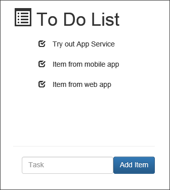
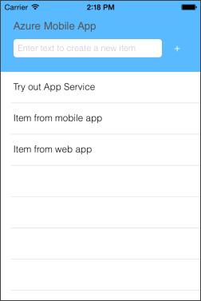

# Create an app with a mobile and web client in Azure App Service

This topic shows you how to create an app with both a mobile and web client. You will create a mobile app and a web app and use the same underlying database for both.

First you will create both a new mobile app backend and a simple *To do list* app that stores app data in the new mobile app backend. The mobile app backend uses the supported .NET languages for server-side business logic. The client app can use any client platform supported by Mobile App, including iOS, Windows, Xamarin iOS, and Xamarin Android.

Then, you will create a web app, using the same database as your mobile app. At the end of the tutorial, you will have a web client and a mobile client that work with the same data.

>[AZURE.NOTE] If you want to get started with Azure App Service before signing up for an Azure account, go to [Try App Service](http://go.microsoft.com/fwlink/?LinkId=523751), where you can immediately create a short-lived starter web app in App Service. No credit cards required; no commitments.

## Create a new mobile app backend and client

* Follow the steps in the tutorial [Create a mobile app] to create both a mobile app backend and a client. You can use any client platform supported by Mobile Apps, including iOS, Windows, Xamarin iOS, and Xamarin Android.

* Ensure that you have deployed your mobile app backend to Azure and that you connect your mobile client application to the hosted backend. The mobile app code project uses Entity Framework Code First and initializes the database after the first REST request from a mobile client app.

## Publish a TodoList Web API from Visual Studio

In this section, you will create a new web app using a sample Web Application solution. You will modify the sample to use the same database schema name and the same connection string as the mobile app.

    > [AZURE.NOTE] Before completing these steps, ensure that you've initialized your mobile app backend database by connecting a client to it. Otherwise, the web app will not be able to connect to the same database.

1. In the [Azure Portal](https://portal.azure.com/), create a new web app, using the same Resource Group and Hosting Plan as your mobile app.

2. Download the sample solution [MultiChannelToDo] and open in Visual Studio. The solution contains both a Web API project and a Web Application Project for the web client UI.

3. In the Web API project, edit MultiChannelToDoContext.cs. In `OnModelCreating`, update the schema name to be the same as your mobile app name:

        modelBuilder.HasDefaultSchema("your_mobile_app"); // your service name, replacing dashes with underscore

4. Next we will get the mobile app connection string from the Azure Portal:

    - Select your mobile app in the portal and click the part labeled **User Code**.

    - In the blade that opens, select **All Settings**, then **Application Settings**.

    - Under **Connection Strings** click **Show Connection Strings**. Copy the value for the setting **MS_TableConnectionString**. This is the connection string used by your mobile app to connect to the SQL Database.

5. In Visual Studio, right click the Web API project and select **Publish**. Select **Azure Web Apps** as the publish target, and select the web app you created above. Click **Next** until you get to the **Settings** section of the Publish Web wizard.

6. In the **Databases** section, paste the mobile app connection string as the value for **MultiChannelToDoContext**. Select only the checkbox **Use this connection string at runtime**.

7. Once your Web API has been successfully published to Azure, you will see a confirmation page. Copy the URL for your published service.

## Publish a TodoList web client UI from Visual Studio

In this section, you will use a sample web client application implemented with AngularJS. You will then use Visual Studio to publish the project to a new hosted App Service web app in Azure. 

1. In Visual Studio, open the project **MultiChannelToDo.Web**. Edit the file `js/service/ToDoService.js`, adding the URL to the Web API you just published:

        var apiPath = "https://your-web-api-site-name.azurewebsites.net";

2. Right click the project **MultiChannelToDo.Web** and select **Publish**.

3. In the **Publish Web** wizard, select **Azure Web App** as the publish target and create a new web app without a database. 

4. Once your project has been sucessfully published, you will see the web UI in your browser.

## Test the mobile and web apps 

1. In the web UI, add or edit some todo items.

    

2. Run the mobile app that you created in the [Create a mobile app] tutorial. You will see the same todo items as in the web app. 

    

## Next Steps

In this sample we showed how to use the same underlying database for an app that has both a website and a mobile client. Here, we did not have any business logic in the backend that we wanted to reuse across the two clients, so it was sufficient to simply share the same database. In a future tutorial, you will learn how to add business logic to your Web API and reuse that logic in your mobile app backend code.

## What's changed
* For a guide to the change from Websites to App Service see: [Azure App Service and Its Impact on Existing Azure Services](http://go.microsoft.com/fwlink/?LinkId=529714)
* For a guide to the change of the old portal to the new portal see: [Reference for navigating the preview portal](http://go.microsoft.com/fwlink/?LinkId=529715)

<!-- Links -->

[MultiChannelToDo]: https://github.com/Azure/mobile-services-samples/tree/web-mobile/MultiChannelToDo
[Create a mobile app]: app-service-mobile-dotnet-backend-xamarin-ios-get-started-preview.md
