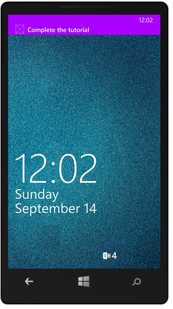

1. Right-click the Windows Store project, click **Set as StartUp Project**, then press the F5 key to run the Windows Store app.
	
	After the app starts, the device is registered for push notifications.

2. Stop the Windows Store app and repeat the previous step to run the Windows Phone Store app.

	At this point, both devices are registered to receive push notifications.

3. Run the Windows Store app again, and type text in **Insert a TodoItem**, and then click **Save**.

   	

   	Note that after the insert completes, both the Windows Store and the Windows Phone apps receive a push notification from WNS.

   	

	The notification is displayed on Windows Phone even when the app isn't running.

   	

