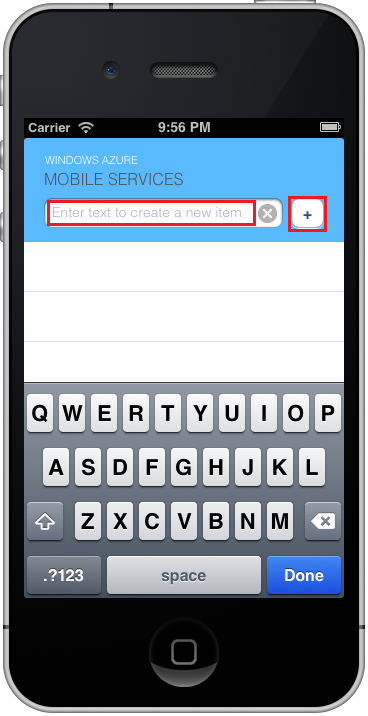

1. On your Mac, visit the [Azure portal]. Click **All Services** > **App Services** > the backend that you just created. In the mobile app settings, choose your preferred language:

    - Objective-C &ndash; **Quickstart** > **iOS (Objective-C)**
    - Swift &ndash; **Quickstart** > **iOS (Swift)**

    Under **3. Configure your client application**, click **Download**. This downloads a complete Xcode project pre-configured to connect to your backend. Open the project using Xcode.

1. Press the **Run** button to build the project and start the app in the iOS simulator.

1. In the app, type meaningful text, such as *Complete the tutorial* and then click the plus (**+**) icon. This sends a POST request to the Azure backend you deployed earlier. The backend inserts data from the request is into the TodoItem SQL table, and returns information about the newly stored items back to the mobile app. The mobile app displays this data in the list.

   

[Azure portal]: https://portal.azure.com/
