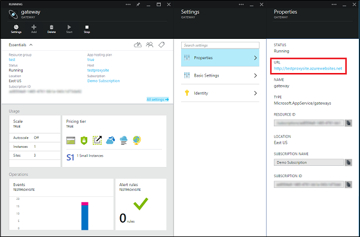

To be able to authenticate users, you must register your app with an identity provider. You must then register the provider-generated client secret with your App Service.

1. Log on to the [Azure Management Portal], click **Browse**, **Resource Group**, and then select the resource group of your Mobile App.

2. Select your gateway, and make a note of the **URL** value under **Properties**. You may need to provide this value to the identity provider when you register your app.

   	

3. Choose a supported identity provider from the list below and follow the steps to configure your app with that provider:

 - <a href="/en-us/documentation/articles/app-service-mobile-how-to-configure-active-directory-authentication-preview/" target="_blank">Azure Active Directory</a>
 - <a href="/en-us/documentation/articles/app-service-mobile-how-to-configure-facebook-authentication-preview/" target="_blank">Facebook login</a>
 - <a href="/en-us/documentation/articles/app-service-mobile-how-to-configure-google-authentication-preview/" target="_blank">Google login</a>
 - <a href="/en-us/documentation/articles/app-service-mobile-how-to-configure-microsoft-authentication-preview/" target="_blank">Microsoft Account</a>
 - <a href="/en-us/documentation/articles/app-service-mobile-how-to-configure-twitter-authentication-preview/" target="_blank">Twitter login</a>

	Your application is now configured to work with your chosen authentication provider.

4. (Optional) Repeat the previous step to configure any other identity provider that you want your app to support. 

<!-- URLs. -->
[Azure Management Portal]: https://manage.windowsazure.com/
