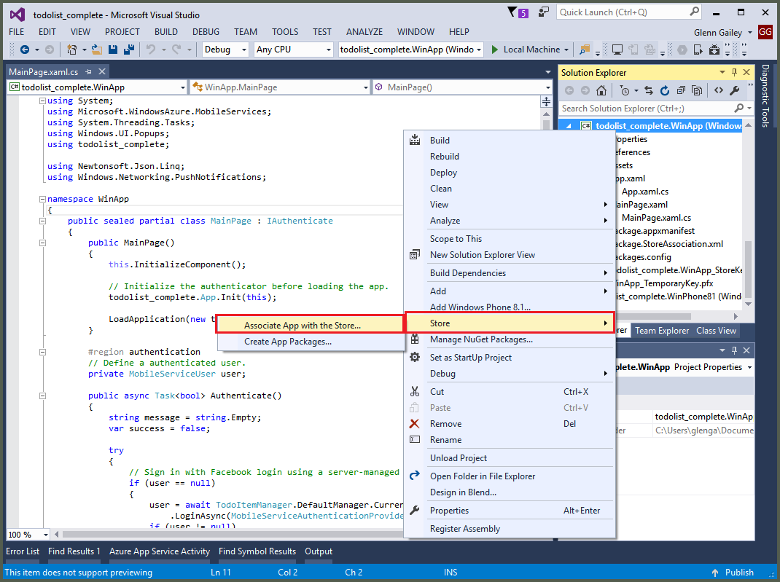
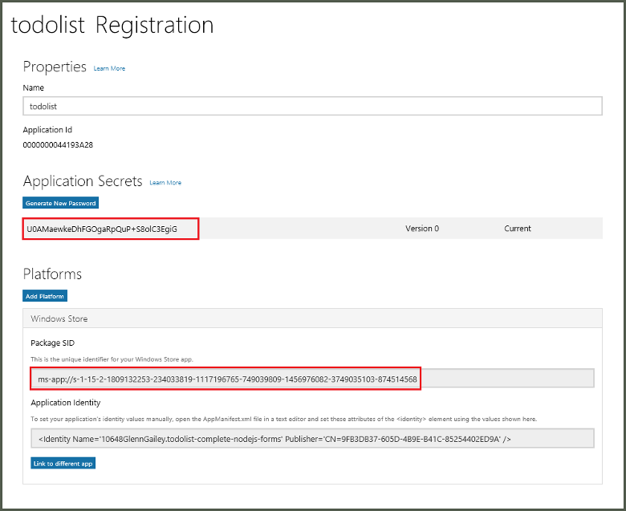

1. In Visual Studio Solution Explorer, right-click the Windows Store app project, click **Store** > **Associate App with the Store...**.

    

2. In the wizard, click **Next**, sign in with your Microsoft account, type a name for your app in **Reserve a new app name**, then click **Reserve**.

3. After the app registration is successfully created, select the new app name, click **Next**, and then click **Associate**. This adds the required Windows Store registration information to the application manifest.

7. Repeat steps 1 and 3 for the Windows Phone Store app project using the same registration you previously created for the Windows Store app.  

7. Navigate to the [Windows Dev Center](https://dev.windows.com/en-us/overview), sign-in with your Microsoft account, click the new app registration in **My apps**, then expand **Services** > **Push notifications**.

8. In the **Push notifications** page, click **Live Services site** under **Windows Push Notification Services (WNS) and Microsoft Azure Mobile Apps**, and make a note of the values of the **Package SID** and the *current*  value in **Application Secret**. 

    

    > [AZURE.IMPORTANT] The application secret and package SID are important security credentials. Do not share these values with anyone or distribute them with your app.
