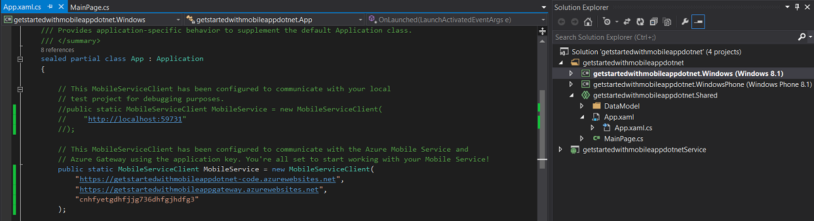

Go back to Visual Studio and select the Shared Code Client App project (it is named like `<your app name>.Shared`)

1. Expand the **App.xaml** file and then open the **App.xaml.cs** file. Look for the MobileService declaration and it should pass in a localhost URL. Comment these three lines out (shortcut for commenting lines in VS is `CTRL+K,CTRL+C`). Now look just below that section and you'll see a similar declaration that passes in 2 URLs and your app key; uncomment those 5 lines (shortcut for uncommenting lines in VS is `CTRL+K,CTRL+U`).

  

2. Press the F5 key to rebuild the project and start the Windows Store app (it should be your default start up project).

2. In the app, type meaningful text, such as *Complete the tutorial*, in the **Insert a TodoItem** textbox, and then click **Save**.

	

	This sends a POST request to the new mobile app backend hosted in Azure.

3. Stop debugging and change the default start up project in the universal Windows solution to the Windows Phone Store app (right click the `<your app name>.WindowsPhone` project and click **Set as StartUp Project**) and press F5 again.

	

	Notice that data saved from the previous step is loaded from the mobile app after the Windows app starts.
