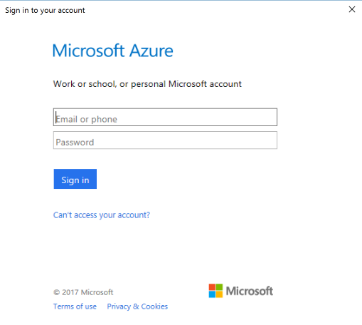

## Step 1: Create an App Service Site with Azure PowerShell

> [!NOTE]
> This article assumes that you have followed the [installation](https://www.microsoft.com/web/handlers/webpi.ashx/getinstaller/WindowsAzurePowershellGet.3f.3f.3fnew.appids) of Azure PowerShell.

### Configuring Azure PowerShell

After you have installed the Azure PowerShell, you must configure it and select which subscription to use when running the commands.

#### Login

**Command**

```powershell
Login-AzureRmAccount
```

**Output**

Sign in using the dialogue box which opens.



> [!TIP]
> There is a possible scenario where you may have multiple Azure Subscriptions in your account. You can list these subscriptions using the following command:
> ```powershell
> Get-AzureRmSubscription | Format-Table SubscriptionName, SubscriptionId
> ```
>
> If you have access to multiple subscriptions, the following command will allow you to set the CLI tools to switch between those accounts.
> ```powershell
> Select-AzureRmSubscription -SubscriptionId <subscription-id>
> ```
> <p></p>

### Create a Resource Group

> [!TIP]
> In order to successfully deploy an Resource Group, ensure that you are selecting a valid region. You can list available regions using the following command:
>
> ```powershell
> Get-AzureRMLocation | Format-Table DisplayName
> ```
> <p></p>

```powershell
New-AzureRMResourceGroup -Name <resource-group-name> -Location <resource-group-location>
```

### Create an App Service Plan

> [!TIP]
> In order to successfully deploy an App Service App, ensure that you are selecting a valid region. You can list available regions using the following command:
>
> ```powershell
> Get-AzureRMLocation | ? { $_.Providers -contains "Microsoft.Web" } | Format-Table DisplayName
> ```
> <p></p>

**Command**

```powershell
New-AzureRmAppServicePlan -Name <plan-name> -ResourceGroupName <resource-group-name> -Location <resource-group-location>
```

**Output**

```text
Sku                       : Microsoft.Azure.Management.WebSites.Models.SkuDescription
ServerFarmWithRichSkuName : <plan-name>
WorkerTierName            :
Status                    : Ready
Subscription              : <subscription-id>
AdminSiteName             :
HostingEnvironmentProfile :
MaximumNumberOfWorkers    : 1
GeoRegion                 : <resource-group-location>
PerSiteScaling            : False
NumberOfSites             : 0
ResourceGroup             : <resource-group-name>
Id                        : /subscriptions/<subscription-id>/resourceGroups/<resource-group-name>/providers/Microsoft.Web/serverfarms/<plan-name>
Name                      : <plan-name>
Location                  : <resource-group-location>
Type                      : Microsoft.Web/serverfarms
Tags                      :

```

### Create an App Service Site

**Command**

```powershell
New-AzureRmWebApp -Name <app-name> -Location <resource-group-location> -AppServicePlan <plan-name> -ResourceGroupName <resource-group-name>
```

**Output**

```text
SiteName                  : <app-name>
State                     : Running
HostNames                 : {<app-name>.azurewebsites.net}
RepositorySiteName        : <app-name>
UsageState                : Normal
Enabled                   : True
EnabledHostNames          : {<app-name>.azurewebsites.net, <app-name>.scm.azurewebsites.net}
AvailabilityState         : Normal
HostNameSslStates         : {<app-name>.azurewebsites.net, <app-name>.scm.azurewebsites.net}
ServerFarmId              : /subscriptions/<subscription-id>/resourceGroups/<resource-group-name>/providers/Microsoft.Web/serverfarms/<plan-name>
LastModifiedTimeUtc       : 1/18/2017 1:35:06 AM
SiteConfig                : Microsoft.Azure.Management.WebSites.Models.SiteConfig
TrafficManagerHostNames   :
PremiumAppDeployed        :
ScmSiteAlsoStopped        : False
TargetSwapSlot            :
HostingEnvironmentProfile :
MicroService              : WebSites
GatewaySiteName           :
ClientAffinityEnabled     : True
ClientCertEnabled         : False
HostNamesDisabled         : False
OutboundIpAddresses       : 23.99.3.91,23.99.3.100,23.99.3.101,23.99.3.151
ContainerSize             : 0
MaxNumberOfWorkers        :
CloningInfo               :
ResourceGroup             : <resource-group-name>
IsDefaultContainer        :
DefaultHostName           : <app-name>.azurewebsites.net
Id                        : /subscriptions/<subscription-id>/resourceGroups/<resource-group-name>/providers/Microsoft.Web/sites/<app-name>
Name                      : <app-name>
Location                  : <resource-group-location>
Type                      : Microsoft.Web/sites
Tags                      :
```