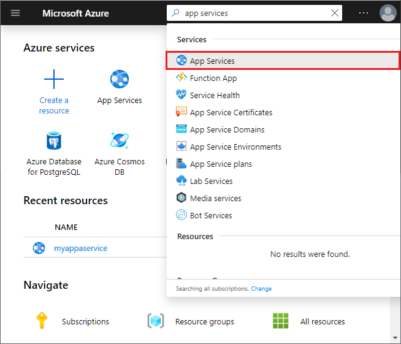

## Prepare your web app

To create custom TLS/SSL bindings or enable client certificates for your App Service app, your [App Service plan](https://azure.microsoft.com/pricing/details/app-service/) must be in the **Basic**, **Standard**, **Premium**, or **Isolated** tier. To make sure that your web app is in the supported pricing tier, follow these steps:

### Go to your web app

1. In the [Azure portal](https://portal.azure.com) search box, find and select **App Services**.

   

1. On the **App Services** page, select your web app's name.

   

   You're now on your web app's management page.

### Check the pricing tier

1. In the left menu for your web app, under the **Settings** section, select **Scale up (App Service plan)**.

   

1. Make sure that your web app isn't in the **F1** or **D1** tier, which doesn't support custom TLS/SSL.

1. If you need to scale up, follow the steps in the next section. Otherwise, close the **Scale up** page, and skip the [Scale up your App Service plan section](#scale-up-your-app-service-plan).

### Scale up your App Service plan

1. Select any non-free tier, such as **B1**, **B2**, **B3**, or any other tier in the **Production** category.

1. When you're done, select **Select**.

   When the following message appears, the scale operation has completed.

   
