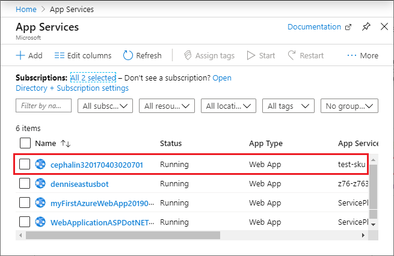
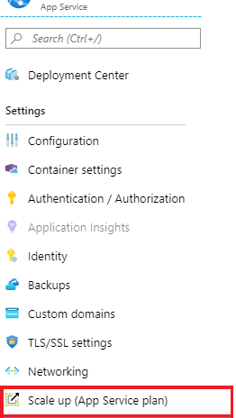
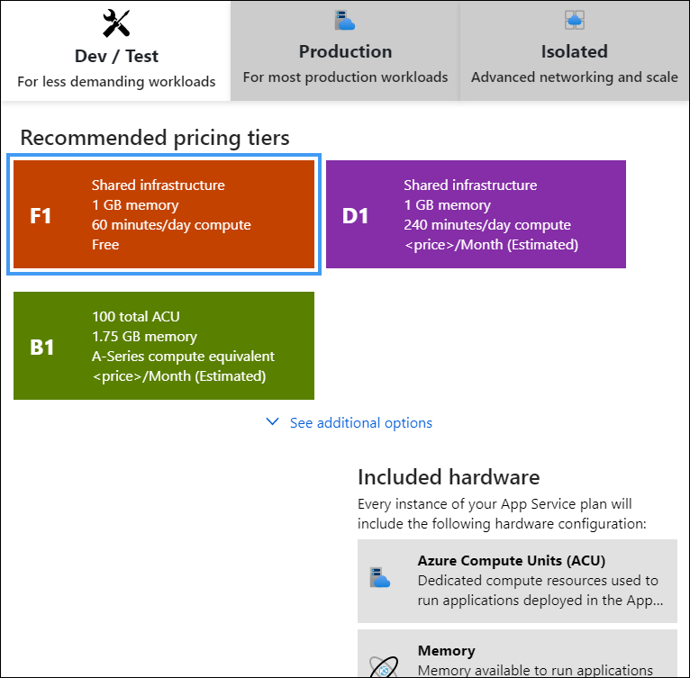
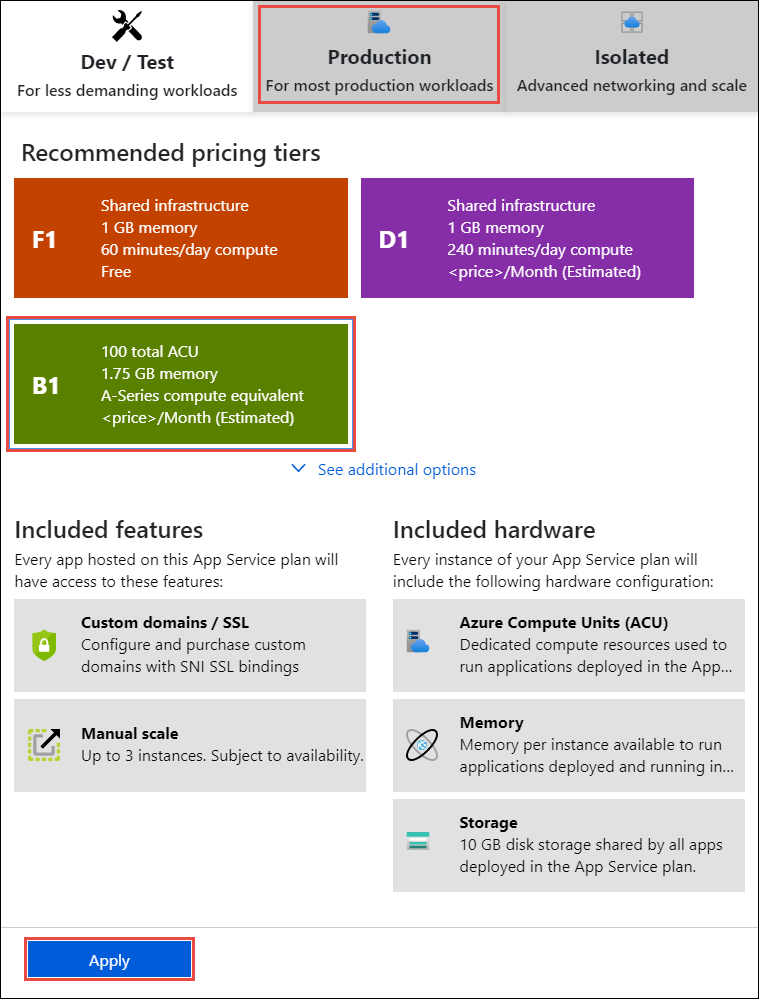
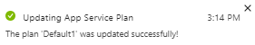

## Prepare your web app

To bind a custom SSL certificate (a third-party certificate or App Service certificate) to your web app, your [App Service plan](https://azure.microsoft.com/pricing/details/app-service/) must be in the **Basic**, **Standard**, **Premium**, or **Isolated** tier. In this step, you make sure that your web app is in the supported pricing tier.

### Log in to Azure

Open the [Azure portal](https://portal.azure.com).

### Navigate to your web app

From the left menu, click **App Services**, and then click the name of your web app.

You have landed in the management page of your web app.  

### Check the pricing tier

In the left-hand navigation of your web app page, scroll to the **Settings** section and select **Scale up (App Service plan)**.

Check to make sure that your web app is not in the **F1** or **D1** tier. Your web app's current tier is highlighted by a dark blue box.

Custom SSL is not supported in the **F1** or **D1** tier. If you need to scale up, follow the steps in the next section. Otherwise, close the **Scale up** page and skip the [Scale up your App Service plan](#scale-up-your-app-service-plan) section.

### Scale up your App Service plan

Select any of the non-free tiers (**B1**, **B2**, **B3**, or any tier in the **Production** category). For additional options, click **See additional options**.

Click **Apply**.

When you see the following notification, the scale operation is complete.

